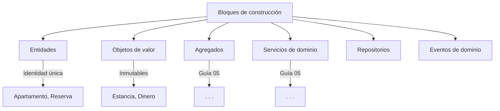
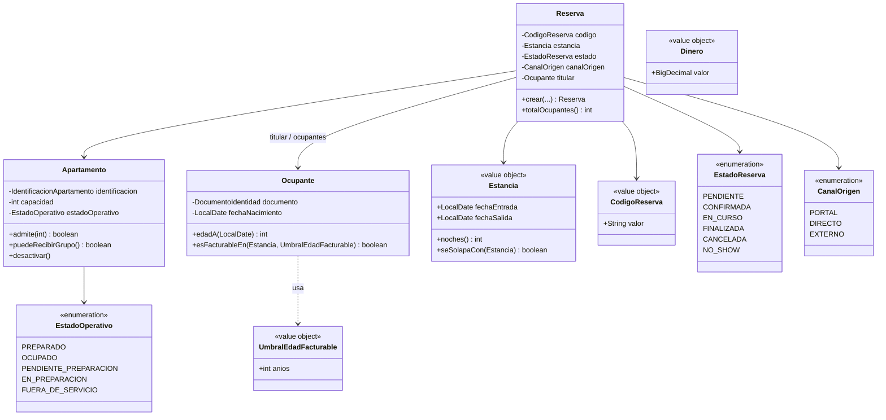

**Programa de Ingeniería de Sistemas y Computación Universidad del Quindío**

**Curso:** Programación Avanzada 
**Guía:** 04 
**Título:** Modelado del Dominio I — Entidades y Objetos de Valor 
**Duración estimada:** 120 minutos 
**Docente:** Jhan Carlos Martinez Ceballos 
**Proyecto del semestre:** SGA — Sistema de Gestión de Alojamiento

---

# 1. Objetivo

En las guías anteriores entendimos **qué problema vamos a resolver**, preparamos el entorno y creamos un proyecto que compila y arranca. Ese proyecto todavía no hace nada. En esta guía empieza a hacer algo, y ese algo es lo más importante del curso:

> **modelar el dominio del SGA en código Java.**

El objetivo **no es memorizar teoría de DDD**, sino aprender a:

- identificar los conceptos importantes del problema,
- diferenciarlos con criterio, no por intuición,
- y expresarlos en código de forma que **una regla del negocio sea imposible de violar**.

Al terminar la guía usted debe poder tomar una frase del documento del proyecto y decidir qué artefacto Java le corresponde.

> En esta guía el código **representa ideas**, no infraestructura. No hay Spring, no hay base de datos, no hay anotaciones. Solo Java.

---

# 2. Conceptos básicos

1. **Dominio.** El conocimiento propio del problema: sus conceptos, sus reglas y sus decisiones. Existe antes del software y sobreviviría sin él.
2. **Entidad.** Concepto del dominio con identidad propia, que cambia de estado a lo largo del tiempo sin dejar de ser el mismo.
3. **Objeto de valor** (_value object_). Concepto que se define únicamente por sus valores, no tiene identidad y es inmutable.
4. **Invariante.** Condición que debe cumplirse **siempre**, en todo momento de la vida del objeto. Un objeto nunca debería poder existir violándola.
5. **Modelo anémico.** Clases del dominio que solo guardan datos, con la lógica dispersa fuera de ellas. Es el antipatrón que esta guía busca evitar.
6. **Excepción de dominio.** Error que expresa "el negocio no permite esto". Es distinto de una falla técnica y debe poder distinguirse.

---

# 3. Contextualización teórica

## 3.1 ¿Qué es el dominio?

El **dominio** es el área de conocimiento en la que está inmerso el problema real. Incluye:

- las reglas que deben cumplirse,
- los conceptos importantes del problema,
- y las decisiones que el sistema puede o no puede tomar.

En este curso el dominio es la **gestión de un alojamiento turístico compuesto por apartamentos autónomos**: inventario, disponibilidad, reservas, ocupación, tarifas y cobros.

Ese dominio ya está descrito. No hay que inventarlo: está en el documento **Proyecto-Final-SGA.md**, en tres secciones que serán su material de trabajo permanente:

|Sección del proyecto|Qué aporta|
|---|---|
|**3. Definiciones operativas**|Elimina ambigüedades: qué es una noche, cómo se calcula un solapamiento, qué significa facturable|
|**4. Lenguaje ubicuo**|El vocabulario obligatorio del proyecto|
|**9. Reglas de negocio invariantes**|Las 22 reglas (RN-01 a RN-22) que todo equipo debe cumplir|

## 3.2 ¿Cómo identificar los elementos importantes del problema?

Una forma sencilla de empezar es preguntarse:

- ¿Qué cosas existen en este problema?
- ¿Qué cosas cambian con el tiempo?
- ¿Qué cosas tienen reglas?

Las respuestas nos llevan a los **conceptos clave del dominio**.

## 3.3 Entidades

Una **entidad** es un objeto del dominio que:

- tiene identidad propia,
- puede cambiar su estado,
- y se distingue de otros objetos similares aunque sus datos coincidan.

Ejemplo del SGA: una _Reserva_ es una entidad. Dos reservas del mismo apartamento, para las mismas fechas y el mismo titular, **no son la misma reserva**: hay que poder distinguirlas, cobrarlas y cancelarlas por separado.

## 3.4 Objetos de valor

Un **objeto de valor** es un objeto que:

- no tiene identidad propia,
- se define únicamente por sus valores,
- y es inmutable: no se modifica, se reemplaza.

Ejemplos del SGA: la estancia (un par de fechas), el estado de una reserva, un valor en pesos, el canal de origen.

## 3.5 Entidad frente a objeto de valor

|Aspecto|Entidad|Objeto de valor|
|---|---|---|
|Identidad|Sí|No|
|Mutabilidad|Puede cambiar|Inmutable|
|Igualdad|Por identidad|Por valores|
|Ejemplo en el SGA|`Reserva`, `Apartamento`|`Estancia`, `Dinero`, `EstadoReserva`|

## 3.6 Lenguaje del dominio (lenguaje compartido)

El **lenguaje del dominio** es el conjunto de palabras que usan las personas involucradas en el problema para entenderse. Incluye conceptos, acciones, estados y reglas implícitas.

Debe ser compartido entre estudiantes, docente, usuarios del sistema **y el código fuente**, de modo que nadie tenga que traducir mentalmente entre lo que se dice y lo que se programa.

> La sección 4 del documento **Proyecto-Final-SGA.md** es la referencia oficial del lenguaje de este dominio. **Los nombres que use en el código deben salir de allí.** Cada equipo puede _agregar_ términos propios de su variante; no puede renombrar ni eliminar los de esa tabla (F-11).

Esto tiene una consecuencia concreta y evaluable: en el SGA **no existen** `Room`, `Booking`, `Guest` ni `Request`. Existen `Apartamento`, `Reserva`, `Ocupante` y `Folio`.

**Referencia:** Evans, E. (2003). _Domain-Driven Design: Tackling Complexity in the Heart of Software_. Addison-Wesley.

## 3.7 Modelo de dominio

Representación abstracta de los conceptos, reglas y relaciones del dominio de negocio.

**Beneficios:**

1. **Comunicación mejorada** entre desarrolladores y expertos del dominio.
2. **Código más expresivo**, que refleja el lenguaje del negocio.
3. **Facilita el mantenimiento** al concentrar la lógica de negocio.
4. **Reduce la brecha** entre análisis y código.
5. **Código autodocumentado** mediante el lenguaje del dominio.

## 3.8 Bloques de construcción



**En esta guía nos enfocaremos en:** entidades y objetos de valor. Los demás bloques llegan en la Guía 05.

---

# 4. Parte 1: Identificando los conceptos del dominio

## 4.1 Contexto del dominio

Lea el siguiente escenario:

> Una familia de cuatro personas —dos adultos y dos niños de 6 y 3 años— reserva por el portal el apartamento 301 del 10 al 12 de diciembre. La recepción confirma la reserva y abre el folio. Al día siguiente, otra familia intenta reservar el mismo apartamento del 11 al 14 de diciembre.

## 4.2 Tres preguntas para decidir

Antes de clasificar un concepto, aplique estas tres pruebas. Si duda, la respuesta casi siempre está en la primera.

**1. Prueba de identidad.** Si dos ejemplares tienen exactamente los mismos datos, ¿son la misma cosa?

- Dos reservas del apartamento 301, del 10 al 12, a nombre del mismo titular, **no son la misma reserva**. Hay que poder distinguirlas → **Entidad**.
- Dos estancias del 10 al 12 de diciembre **son la misma estancia**. No tiene sentido preguntar "¿cuál de las dos?" → **Objeto de valor**.

**2. Prueba de reemplazo.** Si cambia su contenido, ¿sigue siendo el mismo objeto?

- Si una reserva pasa de `PENDIENTE` a `CONFIRMADA`, sigue siendo **esa** reserva → **Entidad** (muta y conserva identidad).
- Si una estancia del 10 al 12 se corrige al 10 al 14, no es "la misma estancia modificada": es **otra estancia** que reemplaza a la anterior → **Objeto de valor** (se reemplaza, no se modifica).

**3. Prueba de ciclo de vida.** ¿Interesa saber cuándo nació, qué le pasó y cuándo terminó?

- De una reserva interesa su historia completa: cuándo se creó, cuándo se confirmó, si se canceló y con qué política → **Entidad**.
- De un par de fechas no interesa "cuándo se creó ese rango" → **Objeto de valor**.

## 4.3 Ejercicio guiado

Aplique las tres pruebas y complete la tabla. La primera fila está resuelta como modelo.

| Término                  | Tipo    | Justificación (según las tres pruebas)                                                                                        |
| ------------------------ | ------- | ----------------------------------------------------------------------------------------------------------------------------- |
| **Reserva**              | Entidad | Dos reservas con los mismos datos son distintas; cambia de estado sin dejar de ser ella misma; interesa su historia completa. |
| **Apartamento**          |         |                                                                                                                               |
| **Estancia**             |         |                                                                                                                               |
| **Capacidad**            |         |                                                                                                                               |
| **Estado de la reserva** |         |                                                                                                                               |
| **Ocupante**             |         |                                                                                                                               |
| **Temporada**            |         |                                                                                                                               |
| **Tarifa**               |         |                                                                                                                               |
| **Folio**                |         |                                                                                                                               |
| **Pago**                 |         |                                                                                                                               |
| **Canal de origen**      |         |                                                                                                                               |
| **Bloqueo**              |         |                                                                                                                               |

Discútalo en grupo antes de responder. Dos casos merecen debate y no tienen respuesta obvia: **Ocupante** y **Pago**. Defiéndalos con las tres pruebas, no con la intuición.

> El resultado de este análisis es nuestro primer modelo de dominio.

## 4.4 Aplicación al proyecto final

Extienda el ejercicio a **su** alojamiento: agregue los conceptos propios de su variante (los que definió o va a definir en la Ficha del Alojamiento, Anexo A) y clasifíquelos con el mismo criterio.

---

# 5. Parte 2: Reglas básicas en el dominio

El dominio no es solo datos. También contiene **reglas de negocio** que definen qué se puede y qué no se puede hacer.

Ejemplos de reglas de este dominio, tomadas de la sección 9 del proyecto:

- un apartamento no puede tener dos reservas activas solapadas (RN-01),
- el total de ocupantes no puede exceder la capacidad del apartamento (RN-02),
- toda estancia tiene al menos una noche (RN-03),
- los cargos y pagos no se modifican ni se eliminan (RN-16).

Estas reglas **deben vivir en el dominio**, no en controladores ni en servicios técnicos (12.1).

## 5.1 De la frase a la regla

Las reglas rara vez aparecen escritas como reglas. Aparecen escondidas en verbos, adjetivos y condiciones del enunciado. El ejercicio consiste en sacarlas a la superficie.

| Frase del escenario                           | Regla que esconde                                                                                             | ¿Dónde vivirá?                                                                                                                     |
| --------------------------------------------- | ------------------------------------------------------------------------------------------------------------- | ---------------------------------------------------------------------------------------------------------------------------------- |
| "del 10 al 12 de diciembre"                   | Son **dos** noches, no tres: el intervalo es `[entrada, salida)`. Y la salida debe ser posterior a la entrada | Tipo `Estancia`, validado al construirlo                                                                                           |
| "una familia de cuatro personas"              | El total de ocupantes no puede exceder la capacidad                                                           | Comportamiento de `Apartamento`                                                                                                    |
| "dos niños de 6 y 3 años"                     | Ocupan cupo, pero solo generan cargo si alcanzan el umbral de edad                                            | Comportamiento de `Ocupante` + el valor `UmbralEdadFacturable`                                                                     |
| >"reserva por el portal"                      | El origen de la reserva es un conjunto cerrado de valores: portal, directo o externo                          | Tipo del objeto de valor `CanalOrigen`                                                                                             |
| >"otra familia intenta reservar del 11 al 14" | Dos reservas activas del mismo apartamento no pueden compartir ninguna noche                                  | Comportamiento de `Estancia` para detectar el solapamiento; la verificación completa necesita conocer las demás reservas (Guía 05) |
| >"la recepción confirma la reserva"           | Solo se puede confirmar una reserva que esté `PENDIENTE`                                                      | Comportamiento de `Reserva` (Guía 05)                                                                                              |

Note que la tercera columna anticipa la traducción a código:

> **Una regla sobre valores permitidos se resuelve con el tipo; una regla sobre el momento en que algo puede ocurrir se resuelve con comportamiento.**

Y note también la última fila del ejemplo del solapamiento: **no todas las reglas caben dentro de una sola clase.** Para saber si el apartamento 301 ya está vendido del 11 al 14 hay que consultar las demás reservas, y eso no lo puede hacer un objeto por sí mismo. Ese tipo de regla se resuelve en la Guía 05.

## 5.2 Ejercicio: identificando reglas de negocio

Lea nuevamente el escenario de la sección 4.1.

> Una familia de cuatro personas —dos adultos y dos niños de 6 y 3 años— reserva por el portal el apartamento 301 del 10 al 12 de diciembre. La recepción confirma la reserva y abre el folio. Al día siguiente, otra familia intenta reservar el mismo apartamento del 11 al 14 de diciembre.

En grupo, identifique **al menos 3 reglas de negocio** que se desprendan de él y que **no** estén en la tabla anterior.

Para cada regla, responda:

- ¿qué acción regula?
- ¿qué condición debe cumplirse?
- ¿qué pasaría si la regla no existiera?

> No escriba código todavía. El objetivo es **pensar como el dominio**, no codificar.

## 5.3 Aplicación al proyecto final

Las 22 reglas de la sección 9 del proyecto son obligatorias para todos los equipos. Además, **su equipo debe definir tres reglas propias** (L-20, sección 10.1), coherentes con el alojamiento de su Ficha y aprobadas por el docente.

Redacte un primer borrador de esas tres reglas y verifique que cumplan el criterio exigido: deben ser **verificables y con consecuencia**, algo que el sistema pueda rechazar o calcular distinto. "Ofrecer buen servicio" no es una regla; "en temporada alta la estancia mínima es de dos noches" sí lo es.

---

# 6. Parte 3: De los conceptos al código Java

Hasta ahora identificó **conceptos**, **entidades**, **objetos de valor** y **reglas de negocio**. Esta parte responde la pregunta que sigue: **¿cómo se convierte cada uno de esos hallazgos en código Java concreto?**

Usaremos únicamente Java puro. Sin Spring, sin anotaciones, sin base de datos.

> El objetivo no es que el sistema funcione, sino que el código **explique el dominio**.

## 6.1 Tabla de traducción

Esta tabla es el puente entre el análisis y el código. Cada hallazgo del análisis tiene una forma esperada en Java:

|Hallazgo del análisis|Artefacto Java|Por qué|
|---|---|---|
|Concepto con identidad que cambia (Reserva, Apartamento)|`class` con campo identificador, sin _setters_|Necesita conservar identidad mientras muta|
|Objeto de valor con un conjunto **cerrado y conocido** de valores (Estado, Canal, Estado operativo)|`enum`|El compilador impide valores inexistentes|
|Objeto de valor con **formato o restricción** (Código de reserva, Correo)|`record` con validación en el constructor compacto|Inmutable e igualdad por valor, gratis|
|Objeto de valor compuesto por varios datos que viajan juntos (Estancia)|`record` con varios componentes|Los datos que cambian juntos se modelan juntos|
|Regla que dice qué valores son válidos|Validación en el constructor|Un objeto nunca existe en estado inválido|
|Regla que dice cuándo se puede hacer algo|Método con nombre del negocio que valida y luego cambia el estado|La regla vive junto al dato que protege|
|Violación de una regla del negocio|Excepción propia del dominio (`ReglaDominioException`)|Distingue error de negocio de error técnico|

Aplicada al escenario de la Parte 1, la traducción queda así:

|Concepto identificado|Clasificación|Artefacto Java|
|---|---|---|
|Reserva|Entidad|`class Reserva`|
|Apartamento|Entidad|`class Apartamento`|
|Ocupante|Entidad|`class Ocupante`|
|Estado de la reserva|Objeto de valor cerrado|`enum EstadoReserva`|
|Estado operativo|Objeto de valor cerrado|`enum EstadoOperativo`|
|Canal de origen|Objeto de valor cerrado|`enum CanalOrigen`|
|Código de reserva|Objeto de valor con formato|`record CodigoReserva`|
|Identificación del apartamento|Objeto de valor con formato|`record IdentificacionApartamento`|
|Documento de identidad|Objeto de valor con formato|`record DocumentoIdentidad`|
|Estancia (entrada + salida)|Objeto de valor compuesto|`record Estancia`|
|Valor monetario|Objeto de valor compuesto|`record Dinero`|
|Umbral de edad facturable|Objeto de valor con restricción|`record UmbralEdadFacturable`|

> **La pregunta que quedó abierta en la Guía 03** —si `Estancia` debía ser entidad u objeto de valor— se responde aquí: es un **objeto de valor**. No tiene identidad, no interesa su historia y, si cambian sus fechas, es otra estancia. Lo que tiene identidad es la **reserva** que la contiene.

## 6.2 Estructura del paquete

A partir del proyecto Spring Boot creado en la guía anterior, trabajará únicamente en el siguiente paquete:

```
co.edu.uniquindio.sga.domain
```

Este paquete será el **núcleo del sistema** y se mantendrá durante todo el semestre.

```
src/main/java/co/edu/uniquindio/sga/domain/
├── entity/
│   ├── Apartamento.java
│   ├── Ocupante.java
│   └── Reserva.java
├── valueobject/
│   ├── CanalOrigen.java
│   ├── CodigoReserva.java
│   ├── Dinero.java
│   ├── DocumentoIdentidad.java
│   ├── Estancia.java
│   ├── EstadoOperativo.java
│   ├── EstadoReserva.java
│   ├── IdentificacionApartamento.java
│   └── UmbralEdadFacturable.java
└── exception/
    └── ReglaDominioException.java
```

> Regla que se debe cumplir en todo momento: **ninguna clase de este paquete importa `org.springframework`, `jakarta.persistence` ni nada parecido.** Si necesita hacerlo, el concepto está mal ubicado. Este punto se verifica en cada corte.

## 6.3 La excepción del dominio

Antes que nada necesitamos una forma de expresar "el negocio no permite esto". Es distinto de un error técnico (`NullPointerException`, `SQLException`) y debe poder distinguirse: más adelante, esa diferencia es la que permitirá responder un `409 Conflict` con significado de negocio en lugar de un `500` con una traza técnica (12.4).

```java
package co.edu.uniquindio.sga.domain.exception;

/**
 * Se lanza cuando una operación viola una regla del negocio.
 * No representa fallas técnicas.
 */
public class ReglaDominioException extends RuntimeException {

    public ReglaDominioException(String mensaje) {
        super(mensaje);
    }
}
```

## 6.4 Objeto de valor con valores cerrados: el enum

Cuando el negocio define una lista fija de valores posibles, el `enum` es la traducción correcta. Su ventaja no es la comodidad: es que **hace imposible representar un valor que el negocio no reconoce**.

```java
package co.edu.uniquindio.sga.domain.valueobject;

/**
 * Estados del ciclo de vida de una reserva (sección 8 del proyecto).
 * Las transiciones entre ellos se implementan en la Guía 05.
 */
public enum EstadoReserva {

    PENDIENTE(true),
    CONFIRMADA(true),
    EN_CURSO(true),
    FINALIZADA(false),
    CANCELADA(false),
    NO_SHOW(false);

    private final boolean activa;

    EstadoReserva(boolean activa) {
        this.activa = activa;
    }

    /** Reservas activas: PENDIENTE, CONFIRMADA y EN_CURSO. */
    public boolean esActiva() {
        return activa;
    }

    /** FINALIZADA, CANCELADA y NO_SHOW son estados terminales. */
    public boolean esTerminal() {
        return !activa;
    }

    /**
     * En este dominio solo las reservas activas retienen noches (RN-12).
     * Se expone como método aparte porque el negocio habla de las dos cosas
     * y podría dejar de coincidir en otro alojamiento.
     */
    public boolean retieneDisponibilidad() {
        return activa;
    }
}
```

```java
package co.edu.uniquindio.sga.domain.valueobject;

/**
 * Condición física presente del apartamento (definición 3.3 del proyecto).
 */
public enum EstadoOperativo {

    PREPARADO,
    OCUPADO,
    PENDIENTE_PREPARACION,
    EN_PREPARACION,
    FUERA_DE_SERVICIO;

    /** RN-11: solo un apartamento PREPARADO puede recibir un grupo. */
    public boolean permiteRegistro() {
        return this == PREPARADO;
    }
}
```

```java
package co.edu.uniquindio.sga.domain.valueobject;

/**
 * Origen de la reserva (sección 2.4 del proyecto).
 */
public enum CanalOrigen {

    PORTAL,
    DIRECTO,
    EXTERNO;

    /**
     * RN-19: toda reserva externa llega con un identificador propio del canal,
     * y la combinación canal + identificador es única.
     */
    public boolean exigeIdentificadorExterno() {
        return this == EXTERNO;
    }
}
```

`permiteRegistro()` y `exigeIdentificadorExterno()` son ejemplos del mismo patrón: **un enum puede contener el conocimiento del negocio sobre sus propios valores.** Que solo un apartamento `PREPARADO` pueda recibir huéspedes no es un detalle técnico ni una nota en un documento: es una regla que el dominio necesita consultar, y su lugar natural es el propio concepto.

Note además que los métodos usan lenguaje del negocio. No se llaman `isReady()` ni `getType()`.

Compare las dos formas de representar lo mismo:

```java
// Incorrecto: el estado como texto libre
private String estado;
reserva.setEstado("confirmda");   // compila, y el error aparece en producción

// Correcto: el estado como concepto del dominio
private EstadoReserva estado;
reserva.setEstado("confirmda");   // no compila
```

## 6.5 Objeto de valor con formato: el record

Cuando el objeto de valor encapsula un dato que debe cumplir una regla de forma, se traduce a un `record` con validación en el **constructor compacto**. El `record` aporta gratis lo que un objeto de valor exige: inmutabilidad, `equals` por valor, `hashCode` y `toString`.

```java
package co.edu.uniquindio.sga.domain.valueobject;

import java.util.regex.Pattern;

import co.edu.uniquindio.sga.domain.exception.ReglaDominioException;

/**
 * Identificador único de una reserva.
 * Formato definido por el negocio: RES-YYYY-NNNNN (ejemplo: RES-2026-00042).
 */
public record CodigoReserva(String valor) {

    private static final Pattern FORMATO = Pattern.compile("^RES-\\d{4}-\\d{5}$");

    public CodigoReserva {
        if (valor == null || valor.isBlank()) {
            throw new ReglaDominioException("El código de la reserva es obligatorio");
        }
        if (!FORMATO.matcher(valor).matches()) {
            throw new ReglaDominioException(
                "El código de la reserva debe tener el formato RES-YYYY-NNNNN");
        }
    }
}
```

```java
package co.edu.uniquindio.sga.domain.valueobject;

import co.edu.uniquindio.sga.domain.exception.ReglaDominioException;

/**
 * Identificación del apartamento dentro del alojamiento (L-04: única y estable).
 * Se normaliza a mayúsculas para que "apt-301" y "APT-301" sean el mismo apartamento.
 */
public record IdentificacionApartamento(String valor) {

    public IdentificacionApartamento {
        if (valor == null || valor.isBlank()) {
            throw new ReglaDominioException("El apartamento debe tener una identificación");
        }
        valor = valor.trim().toUpperCase();
    }
}
```

```java
package co.edu.uniquindio.sga.domain.valueobject;

import co.edu.uniquindio.sga.domain.exception.ReglaDominioException;

/**
 * Documento de identidad de una persona del negocio (titular u ocupante).
 */
public record DocumentoIdentidad(String numero) {

    public DocumentoIdentidad {
        if (numero == null || numero.isBlank()) {
            throw new ReglaDominioException("El documento de identidad es obligatorio");
        }
        numero = numero.trim();
    }
}
```

El constructor compacto (`public CodigoReserva {` sin paréntesis) se ejecuta **antes** de asignar los campos. Es el lugar natural para validar, y también el único lugar donde se puede **normalizar** el valor recibido, como hace `IdentificacionApartamento` al pasarlo a mayúsculas.

Estas tres consecuencias son exactamente lo que se espera de un objeto de valor:

```java
CodigoReserva a = new CodigoReserva("RES-2026-00042");
CodigoReserva b = new CodigoReserva("RES-2026-00042");

a.equals(b);                        // true: igualdad por valor, no por referencia
a.valor();                          // "RES-2026-00042" — solo lectura, no hay setter
new CodigoReserva("42");            // ReglaDominioException: nunca existe un código inválido
```

> **¿Por qué no usar `String` para el código de la reserva?** Porque un `String` acepta `"hola"`, acepta `null`, acepta el nombre del titular por equivocación, y no dice nada sobre su significado. Además, un método `buscar(String, String, String)` es una invitación a pasar los parámetros en el orden equivocado; `buscar(CodigoReserva, DocumentoIdentidad)` no compila si se invierten.

## 6.6 Objeto de valor compuesto: varios datos que viajan juntos

No todo objeto de valor encapsula un solo dato. Cuando el negocio trata varios valores como una unidad, el `record` los agrupa. Este es el caso más importante del SGA.

### La estancia

La definición 3.1 del proyecto dice tres cosas sobre las fechas de una reserva:

> el intervalo es cerrado en la entrada y abierto en la salida, `[entrada, salida)`; del 10 al 12 son **dos** noches; y dos estancias se solapan si `entrada_A < salida_B` y `entrada_B < salida_A`.

Esas tres frases no son documentación: son comportamiento, y pertenecen al tipo que representa el rango.

```java
package co.edu.uniquindio.sga.domain.valueobject;

import java.time.LocalDate;
import java.time.temporal.ChronoUnit;
import java.util.List;

import co.edu.uniquindio.sga.domain.exception.ReglaDominioException;

/**
 * Rango continuo de noches en que un apartamento queda ocupado.
 * Intervalo cerrado en la entrada y abierto en la salida: [entrada, salida).
 */
public record Estancia(LocalDate fechaEntrada, LocalDate fechaSalida) {

    public Estancia {
        if (fechaEntrada == null || fechaSalida == null) {
            throw new ReglaDominioException("La estancia requiere fecha de entrada y de salida");
        }
        // RN-03: toda estancia tiene al menos una noche
        if (!fechaSalida.isAfter(fechaEntrada)) {
            throw new ReglaDominioException(
                "La fecha de salida debe ser posterior a la fecha de entrada");
        }
    }

    /** Del 10 al 12 son dos noches: la del 10 y la del 11. */
    public int noches() {
        return (int) ChronoUnit.DAYS.between(fechaEntrada, fechaSalida);
    }

    /** La noche de la fecha de salida no se ocupa ni se cobra. */
    public boolean incluye(LocalDate noche) {
        return !noche.isBefore(fechaEntrada) && noche.isBefore(fechaSalida);
    }

    /** RN-01: dos estancias se solapan si comparten al menos una noche. */
    public boolean seSolapaCon(Estancia otra) {
        return this.fechaEntrada.isBefore(otra.fechaSalida)
            && otra.fechaEntrada.isBefore(this.fechaSalida);
    }

    /** Las noches efectivamente ocupadas, útiles para liquidar noche por noche (RN-05). */
    public List<LocalDate> nochesOcupadas() {
        return fechaEntrada.datesUntil(fechaSalida).toList();
    }
}
```

Observe lo que acaba de ocurrir: la regla RN-03 dejó de ser una fila en una tabla y pasó a ser **imposible de violar**. No existe forma de construir una `Estancia` de cero noches.

```java
new Estancia(LocalDate.of(2026, 12, 10), LocalDate.of(2026, 12, 12));  // válida, 2 noches
new Estancia(LocalDate.of(2026, 12, 10), LocalDate.of(2026, 12, 10));  // ReglaDominioException
new Estancia(LocalDate.of(2026, 12, 12), LocalDate.of(2026, 12, 10));  // ReglaDominioException
```

Y el solapamiento, que es **el riesgo central del negocio** (sección 2.5), quedó en un solo lugar del sistema en vez de repetido en cada consulta:

```java
Estancia diciembre10al12 = new Estancia(LocalDate.of(2026, 12, 10), LocalDate.of(2026, 12, 12));
Estancia diciembre11al14 = new Estancia(LocalDate.of(2026, 12, 11), LocalDate.of(2026, 12, 14));
Estancia diciembre12al14 = new Estancia(LocalDate.of(2026, 12, 12), LocalDate.of(2026, 12, 14));

diciembre10al12.seSolapaCon(diciembre11al14);   // true:  comparten la noche del 11
diciembre10al12.seSolapaCon(diciembre12al14);   // false: el que sale el 12 libera esa noche
```

> **Cuidado con lo que NO va aquí.** La regla RN-04 dice que no se pueden crear reservas con fecha de entrada anterior a hoy. Podría parecer que también corresponde a `Estancia`, pero no: una estancia del año pasado es perfectamente válida como dato histórico. Lo que el negocio prohíbe es **crear una reserva nueva** hacia el pasado. Esa regla vive en `Reserva`, no en `Estancia`. Distinguir "qué valores son válidos" de "cuándo se puede hacer algo" es exactamente el criterio de la sección 5.1.

### El dinero

La definición 3.4 es tajante: moneda única en pesos colombianos, sin decimales, con un tipo de precisión exacta, y **prohibido `float` o `double`**.

```java
package co.edu.uniquindio.sga.domain.valueobject;

import java.math.BigDecimal;
import java.math.RoundingMode;

import co.edu.uniquindio.sga.domain.exception.ReglaDominioException;

/**
 * Valor monetario en pesos colombianos, sin decimales (definición 3.4).
 * Se admiten valores negativos: los ajustes por modificación y los saldos
 * a favor del huésped lo son.
 */
public record Dinero(BigDecimal valor) {

    public static final Dinero CERO = new Dinero(BigDecimal.ZERO);

    public Dinero {
        if (valor == null) {
            throw new ReglaDominioException("El valor monetario es obligatorio");
        }
        valor = valor.setScale(0, RoundingMode.HALF_UP);
    }

    public static Dinero de(long pesos) {
        return new Dinero(BigDecimal.valueOf(pesos));
    }

    public Dinero mas(Dinero otro) {
        return new Dinero(this.valor.add(otro.valor));
    }

    public Dinero menos(Dinero otro) {
        return new Dinero(this.valor.subtract(otro.valor));
    }

    public Dinero por(int cantidad) {
        return new Dinero(this.valor.multiply(BigDecimal.valueOf(cantidad)));
    }

    public boolean esCero() {
        return this.valor.signum() == 0;
    }

    public boolean esNegativo() {
        return this.valor.signum() < 0;
    }
}
```

Tres decisiones que conviene entender:

- **`BigDecimal` y no `double`.** Con `double`, `0.1 + 0.2` no es `0.3`. En un folio con veinte movimientos eso se convierte en un saldo que no cuadra y que nadie puede explicar.
- **Los métodos devuelven un `Dinero` nuevo.** Un objeto de valor no se modifica: `folio.saldo().mas(pago)` produce otro valor, no altera el anterior.
- **Se permiten negativos.** Sería tentador prohibirlos "porque el dinero no es negativo", pero la sección 7.7 exige justamente lo contrario: el saldo puede ser negativo cuando hay saldo a favor, y un ajuste por modificación puede reducir el valor de la reserva. Una validación de más habría contradicho al negocio.

### El umbral de edad facturable

```java
package co.edu.uniquindio.sga.domain.valueobject;

import co.edu.uniquindio.sga.domain.exception.ReglaDominioException;

/**
 * Edad a partir de la cual un ocupante genera cargo (L-09).
 * El valor lo define cada alojamiento: es configuración, no una constante.
 */
public record UmbralEdadFacturable(int anios) {

    public UmbralEdadFacturable {
        if (anios < 0 || anios > 30) {
            throw new ReglaDominioException(
                "El umbral de edad facturable debe estar entre 0 y 30 años");
        }
    }
}
```

> **Por qué esto es un tipo y no un número suelto.** El documento del proyecto lo advierte: _"si algo cambia de un alojamiento a otro, no puede estar quemado en el código"_. Un `12` disperso por el sistema es imposible de rastrear y cambiarlo obliga a recompilar. Un `UmbralEdadFacturable` se lee, se configura y se pasa como parámetro. **Este punto se evalúa.**

## 6.7 Entidad: clase con identidad y comportamiento

Una entidad se traduce a una `class` (no a un `record`, porque debe poder cambiar). Tres decisiones la definen:

1. El identificador es `final`: la identidad **nunca** cambia.
2. No hay _setters_: el estado cambia mediante métodos con nombre del negocio.
3. `equals` y `hashCode` se basan **solo en el identificador**.

```java
package co.edu.uniquindio.sga.domain.entity;

import co.edu.uniquindio.sga.domain.exception.ReglaDominioException;
import co.edu.uniquindio.sga.domain.valueobject.EstadoOperativo;
import co.edu.uniquindio.sga.domain.valueobject.IdentificacionApartamento;

public class Apartamento {

    private final IdentificacionApartamento identificacion;   // identidad: no cambia nunca

    private String nombre;                                    // estado: puede cambiar
    private int dormitorios;
    private int capacidad;
    private EstadoOperativo estadoOperativo;
    private boolean activo;

    public Apartamento(IdentificacionApartamento identificacion, String nombre,
                       int dormitorios, int capacidad) {
        if (identificacion == null) {
            throw new ReglaDominioException("El apartamento debe tener identificación");
        }
        if (nombre == null || nombre.isBlank()) {
            throw new ReglaDominioException("El apartamento debe tener un nombre");
        }
        if (dormitorios < 1) {
            throw new ReglaDominioException("El apartamento debe tener al menos un dormitorio");
        }
        if (capacidad < 1) {
            throw new ReglaDominioException("La capacidad del apartamento debe ser al menos 1");
        }
        this.identificacion = identificacion;
        this.nombre = nombre;
        this.dormitorios = dormitorios;
        this.capacidad = capacidad;
        this.estadoOperativo = EstadoOperativo.PREPARADO;
        this.activo = true;
    }

    // Comportamiento: los nombres vienen del lenguaje del dominio

    /** RN-02: la capacidad es un tope rígido, sin excepciones. */
    public boolean admite(int totalOcupantes) {
        return totalOcupantes > 0 && totalOcupantes <= capacidad;
    }

    /** RN-11: solo se entrega un apartamento activo y PREPARADO. */
    public boolean puedeRecibirGrupo() {
        return activo && estadoOperativo.permiteRegistro();
    }

    /** La eliminación de apartamentos es lógica (7.3). */
    public void desactivar() {
        this.activo = false;
    }

    public IdentificacionApartamento getIdentificacion() {
        return identificacion;
    }

    public String getNombre() {
        return nombre;
    }

    public int getDormitorios() {
        return dormitorios;
    }

    public int getCapacidad() {
        return capacidad;
    }

    public EstadoOperativo getEstadoOperativo() {
        return estadoOperativo;
    }

    public boolean estaActivo() {
        return activo;
    }

    // Dos apartamentos son el mismo si tienen la misma identificación,
    // aunque hayan cambiado de nombre, de dotación o de estado.

    @Override
    public boolean equals(Object o) {
        if (this == o) {
            return true;
        }
        if (!(o instanceof Apartamento otro)) {
            return false;
        }
        return this.identificacion.equals(otro.identificacion);
    }

    @Override
    public int hashCode() {
        return identificacion.hashCode();
    }
}
```

La diferencia con un objeto de valor se ve al comparar los dos `equals`:

```java
// Objeto de valor: iguales si sus valores son iguales
new Estancia(entrada, salida).equals(new Estancia(entrada, salida));   // true

// Entidad: iguales si su identidad es la misma, sin importar los demás datos
Apartamento a1 = new Apartamento(new IdentificacionApartamento("APT-301"), "Balcón", 2, 4);
Apartamento a2 = new Apartamento(new IdentificacionApartamento("APT-301"), "Mirador", 2, 6);
a1.equals(a2);   // true: es el mismo apartamento, renombrado y reconfigurado
```

> Los métodos que cambian el estado operativo (`marcarOcupado`, `marcarPendientePreparacion`, `declararFueraDeServicio`) y el que cambia la capacidad **no están aquí a propósito**: cada uno tiene reglas de transición que se estudian en la Guía 05. Recuerde además que cambiar la capacidad no afecta las reservas ya creadas (7.3), y esa consecuencia no es trivial de implementar.

## 6.8 La entidad Ocupante

`Ocupante` reúne dos ideas del proyecto que se confunden con frecuencia: **capacidad y facturación son dos cuentas distintas sobre las mismas personas** (2.3), y **la edad se calcula, nunca se almacena** (3.2).

```java
package co.edu.uniquindio.sga.domain.entity;

import java.time.LocalDate;
import java.time.Period;

import co.edu.uniquindio.sga.domain.exception.ReglaDominioException;
import co.edu.uniquindio.sga.domain.valueobject.DocumentoIdentidad;
import co.edu.uniquindio.sga.domain.valueobject.Estancia;
import co.edu.uniquindio.sga.domain.valueobject.UmbralEdadFacturable;

public class Ocupante {

    private final DocumentoIdentidad documento;      // identidad
    private final LocalDate fechaNacimiento;         // no cambia nunca

    private String nombre;

    public Ocupante(DocumentoIdentidad documento, String nombre,
                    LocalDate fechaNacimiento, LocalDate fechaActual) {
        if (documento == null) {
            throw new ReglaDominioException("El ocupante debe tener documento de identidad");
        }
        if (nombre == null || nombre.isBlank()) {
            throw new ReglaDominioException("El ocupante debe tener nombre");
        }
        if (fechaNacimiento == null) {
            throw new ReglaDominioException("El ocupante debe tener fecha de nacimiento");
        }
        if (fechaNacimiento.isAfter(fechaActual)) {
            throw new ReglaDominioException("La fecha de nacimiento no puede ser futura");
        }
        this.documento = documento;
        this.nombre = nombre;
        this.fechaNacimiento = fechaNacimiento;
    }

    /** La edad se calcula. Nunca se almacena, porque cambiaría sola con el tiempo. */
    public int edadA(LocalDate fecha) {
        return Period.between(fechaNacimiento, fecha).getYears();
    }

    /**
     * RN-06: es facturable si a la FECHA DE ENTRADA alcanza el umbral.
     * Quien cumple años durante la estancia no cambia de condición a mitad de camino.
     */
    public boolean esFacturableEn(Estancia estancia, UmbralEdadFacturable umbral) {
        return edadA(estancia.fechaEntrada()) >= umbral.anios();
    }

    public void actualizarNombre(String nuevoNombre) {
        if (nuevoNombre == null || nuevoNombre.isBlank()) {
            throw new ReglaDominioException("El ocupante debe tener nombre");
        }
        this.nombre = nuevoNombre;
    }

    public DocumentoIdentidad getDocumento() {
        return documento;
    }

    public String getNombre() {
        return nombre;
    }

    public LocalDate getFechaNacimiento() {
        return fechaNacimiento;
    }

    @Override
    public boolean equals(Object o) {
        if (this == o) {
            return true;
        }
        if (!(o instanceof Ocupante otro)) {
            return false;
        }
        return this.documento.equals(otro.documento);
    }

    @Override
    public int hashCode() {
        return documento.hashCode();
    }
}
```

Dos observaciones sobre este código:

- **`fechaActual` llega como parámetro** en lugar de invocar `LocalDate.now()` dentro de la clase. Un objeto del dominio que le pregunta la hora al sistema operativo es casi imposible de probar: no se puede escribir una prueba del comportamiento "el 31 de diciembre" sin cambiar el reloj del computador. Este detalle vuelve a aparecer en la Guía 05.1 (pruebas unitarias del dominio).
- **`Ocupante` es discutible.** Con la prueba de identidad es una entidad: dos personas con el mismo documento son la misma persona. Pero si su equipo decide que solo le interesa la _composición del grupo_ y no la persona, puede modelarlo como objeto de valor. **Lo que no es aceptable es no haberlo pensado.** Defienda su decisión en la sustentación del Corte 1.

## 6.9 La entidad Reserva

`Reserva` reúne todo lo anterior: identidad propia, objetos de valor como atributos, otras entidades relacionadas y validaciones que impiden un estado inicial inválido.

```java
package co.edu.uniquindio.sga.domain.entity;

import java.time.LocalDate;
import java.util.List;

import co.edu.uniquindio.sga.domain.exception.ReglaDominioException;
import co.edu.uniquindio.sga.domain.valueobject.CanalOrigen;
import co.edu.uniquindio.sga.domain.valueobject.CodigoReserva;
import co.edu.uniquindio.sga.domain.valueobject.Estancia;
import co.edu.uniquindio.sga.domain.valueobject.EstadoReserva;

public class Reserva {

    private final CodigoReserva codigo;          // identidad
    private final CanalOrigen canalOrigen;       // por dónde entró: no cambia nunca
    private final LocalDate fechaCreacion;
    private final Ocupante titular;

    private Apartamento apartamento;             // estado que evoluciona
    private Estancia estancia;
    private List<Ocupante> ocupantes;
    private EstadoReserva estado;

    private Reserva(CodigoReserva codigo, Apartamento apartamento, Estancia estancia,
                    Ocupante titular, List<Ocupante> ocupantes,
                    CanalOrigen canalOrigen, LocalDate fechaCreacion) {
        this.codigo = codigo;
        this.apartamento = apartamento;
        this.estancia = estancia;
        this.titular = titular;
        this.ocupantes = List.copyOf(ocupantes);      // copia inmutable: nadie la altera por fuera
        this.canalOrigen = canalOrigen;
        this.fechaCreacion = fechaCreacion;
        this.estado = EstadoReserva.PENDIENTE;        // toda reserva nace PENDIENTE
    }

    /**
     * Única puerta de entrada para crear una reserva.
     * El nombre viene del lenguaje del dominio, no de la técnica.
     */
    public static Reserva crear(CodigoReserva codigo, Apartamento apartamento,
                                Estancia estancia, Ocupante titular,
                                List<Ocupante> ocupantes, CanalOrigen canalOrigen,
                                LocalDate fechaActual) {

        if (codigo == null) {
            throw new ReglaDominioException("La reserva debe tener un código");
        }
        if (apartamento == null) {
            throw new ReglaDominioException("La reserva debe tener un apartamento");
        }
        if (estancia == null) {
            throw new ReglaDominioException("La reserva debe tener una estancia");
        }
        if (titular == null) {
            throw new ReglaDominioException("La reserva debe tener un titular");
        }
        if (canalOrigen == null) {
            throw new ReglaDominioException("La reserva debe indicar su canal de origen");
        }
        if (ocupantes == null || ocupantes.isEmpty()) {
            throw new ReglaDominioException("La reserva debe tener al menos un ocupante");
        }
        if (!ocupantes.contains(titular)) {
            throw new ReglaDominioException("El titular debe ser uno de los ocupantes");
        }
        if (ocupantes.stream().distinct().count() != ocupantes.size()) {
            throw new ReglaDominioException("No se puede repetir un ocupante en la reserva");
        }
        // RN-04: no se crean reservas hacia el pasado
        if (estancia.fechaEntrada().isBefore(fechaActual)) {
            throw new ReglaDominioException(
                "La fecha de entrada no puede ser anterior a la fecha actual");
        }
        if (!apartamento.estaActivo()) {
            throw new ReglaDominioException("El apartamento no está disponible para la venta");
        }
        // RN-02: la capacidad es un tope rígido
        if (!apartamento.admite(ocupantes.size())) {
            throw new ReglaDominioException(
                "El número de ocupantes excede la capacidad del apartamento");
        }
        return new Reserva(codigo, apartamento, estancia, titular,
                           ocupantes, canalOrigen, fechaActual);
    }

    /** Cuántas personas ocupan el apartamento. Todas cuentan para la capacidad. */
    public int totalOcupantes() {
        return ocupantes.size();
    }

    public CodigoReserva getCodigo() {
        return codigo;
    }

    public EstadoReserva getEstado() {
        return estado;
    }

    public Estancia getEstancia() {
        return estancia;
    }

    public Apartamento getApartamento() {
        return apartamento;
    }

    public Ocupante getTitular() {
        return titular;
    }

    /** Lista inmutable: agregar ocupantes exige pasar por el comportamiento del dominio. */
    public List<Ocupante> getOcupantes() {
        return ocupantes;
    }

    public CanalOrigen getCanalOrigen() {
        return canalOrigen;
    }

    public LocalDate getFechaCreacion() {
        return fechaCreacion;
    }

    @Override
    public boolean equals(Object o) {
        if (this == o) {
            return true;
        }
        if (!(o instanceof Reserva otra)) {
            return false;
        }
        return this.codigo.equals(otra.codigo);
    }

    @Override
    public int hashCode() {
        return codigo.hashCode();
    }
}
```

Observe cuatro decisiones deliberadas:

- El constructor es **privado** y se accede por el método `crear`. Así existe un único punto donde se valida el nacimiento de una reserva.
- `estado` se inicializa en `PENDIENTE`. No se recibe por parámetro: **el negocio dice cómo nace una reserva**, no quien la construye.
- `List.copyOf(ocupantes)` crea una copia inmutable. Sin ella, quien llamó a `crear` conserva una referencia a la lista y podría agregarle una quinta persona a un apartamento de cuatro, **saltándose la validación que acabamos de escribir**.
- No hay `setEstado`, `setEstancia` ni `setApartamento`. Los métodos que cambian el estado (`confirmar`, `cancelar`, `registrarLlegada`, `registrarSalida`, `modificarEstancia`) se agregan en la **Guía 05**, donde se estudian las reglas que los gobiernan.

**Dos cosas que faltan a propósito.** Al crear la reserva, el negocio exige también verificar que no haya solapamiento con otras reservas ni con bloqueos (RN-01, RN-07), y congelar el valor calculado con las tarifas vigentes (RN-22). Ninguna de las dos cabe dentro de esta clase: la primera necesita conocer **todas** las demás reservas del apartamento, y la segunda necesita las temporadas y tarifas. Ambas llegan en las guías siguientes. Que la entidad no pueda resolverlo sola no es un defecto del diseño; es la razón por la que existen los agregados y los servicios de dominio.

## 6.10 El modelo resultante de esta guía



`Dinero` aparece sin relaciones todavía: entra en escena con las tarifas y el folio, en las guías siguientes.

## 6.11 Modelo anémico: el error más frecuente

Un **modelo anémico** es aquel en el que las clases del dominio solo guardan datos y toda la lógica vive fuera. Es el resultado natural de traducir el análisis a código sin criterio, y es exactamente lo que esta guía busca evitar.

```java
// Modelo anémico: la clase no protege nada
public class Reserva {
    private String estado;
    private LocalDate fechaEntrada;
    private LocalDate fechaSalida;
    private int ocupantes;

    public String getEstado() { return estado; }
    public void setEstado(String estado) { this.estado = estado; }
    public int getOcupantes() { return ocupantes; }
    public void setOcupantes(int ocupantes) { this.ocupantes = ocupantes; }
    // ... y así con todos los campos
}

// La regla termina dispersa, repetida y fuera del dominio
if (reserva.getOcupantes() > apartamento.getCapacidad()) {
    throw new RuntimeException("no cabe");
}
reserva.setOcupantes(5);
```

El problema no es estético. Es que **esa validación se olvida** la próxima vez que alguien escriba `setOcupantes` desde otro lugar del sistema —el controlador del portal, el adaptador del canal externo, el cargador de datos de prueba— y nada lo impide. En el SGA eso significa un apartamento de cuatro personas con seis huéspedes adentro, o dos familias con la llave del mismo apartamento el mismo día.

```java
// Modelo rico: la regla vive junto al dato que protege (Guía 05)
reserva.modificarOcupantes(nuevosOcupantes);   // valida internamente, o falla
```

**Referencia:** Fowler, M. — [Anemic Domain Model](https://martinfowler.com/bliki/AnemicDomainModel.html)

> **Nota sobre Lombok.** En la Guía 03 se agregó Lombok al proyecto. `@Data` y `@Setter` sobre una clase del dominio generan exactamente el modelo anémico de arriba, en una sola línea y sin que se note. **No use Lombok dentro del paquete `domain`.** Fuera de él —en los DTO y los adaptadores— es perfectamente razonable.

## 6.12 Errores frecuentes al traducir

|Error|Consecuencia|Corrección|
|---|---|---|
|Usar `String` para estado, canal o estado operativo|El compilador no detecta valores inexistentes|`enum`|
|Usar `double` o `float` para dinero|Saldos que no cuadran y nadie puede explicar|`BigDecimal` dentro de `Dinero`|
|Dos campos `LocalDate` sueltos en `Reserva`|La regla de las noches y el solapamiento se repiten en cada consulta|Objeto de valor `Estancia`|
|Guardar la edad del ocupante|El dato envejece solo y queda desactualizado|Guardar la fecha de nacimiento y calcular|
|Quemar el umbral de edad, el tiempo de preparación o los plazos|Cambiar un valor de negocio obliga a recompilar|Objetos de valor de configuración|
|Poner _setters_ en las entidades|Cualquier código puede dejar el objeto en estado inválido|Métodos con nombre del negocio|
|Validar en el controlador o en el servicio|La regla se repite y se olvida en algún camino|Validar en el constructor o en el método del dominio|
|Exponer la lista de ocupantes sin copiar|Se puede modificar el grupo saltándose la validación de capacidad|`List.copyOf` y getter inmutable|
|`equals` de una entidad comparando todos los campos|Un apartamento que cambia de nombre "deja de ser" el mismo|`equals` solo por identidad|
|Objeto de valor mutable (clase con _setters_)|Dos objetos que eran iguales dejan de serlo sin aviso|`record`|
|Nombres técnicos o en inglés (`BookingDTO`, `Room`, `process`)|El código deja de explicar el negocio y contradice F-11|Nombres del lenguaje ubicuo|
|Convertir todo en objeto de valor|Modelo inflado e ilegible|Aplicar las tres pruebas de la Parte 1|

---

# 7. Parte 4: Actividad

Sobre el proyecto Spring Boot de la guía anterior, en el paquete `co.edu.uniquindio.sga.domain`:

1. Cree la excepción `ReglaDominioException`.
2. Cree **al menos 4 objetos de valor**: mínimo un `enum` de valores cerrados, mínimo un `record` con validación de formato y mínimo un `record` compuesto por varios datos.
3. Cree **al menos 3 entidades** con identificador `final`, sin _setters_ y con `equals`/`hashCode` por identidad.
4. Implemente en el dominio, como mínimo, estas reglas invariantes: **RN-02** (capacidad), **RN-03** (al menos una noche), **RN-04** (no reservar hacia el pasado) y **RN-06** (ocupante facturable).
5. Complete la tabla de traducción de la sección 6.1 con los conceptos **de su alojamiento**, incluyendo los que se derivan de sus tres reglas propias (L-20).
6. Verifique que ninguna clase del paquete `domain` importe clases de Spring, JPA o cualquier framework, ni use anotaciones de Lombok.
7. Haga _commit_ con mensajes descriptivos. El historial es evidencia evaluable.

Cada artefacto debe:

- usar nombres del lenguaje ubicuo (sección 4 de **Proyecto-Final-SGA.md**),
- reflejar un concepto real del problema,
- y no contener valores de negocio quemados en el código.

## 7.1 Aplicación al proyecto final

Este código **no es un ejercicio desechable**: es el primer entregable del Corte 1, que exige _"el dominio implementado con sus reglas invariantes y sus pruebas unitarias"_. Todo lo que escriba hoy sobrevive hasta la sustentación final.

Si su equipo aún no ha completado la **Ficha del Alojamiento** (Anexo A), hágalo ahora: sin capacidades, umbral de edad ni temporadas definidas, el modelo se construye sobre supuestos y habrá que rehacerlo.

---

# 8. Precauciones y recomendaciones

1. **No sobre-ingenierizar.** No convierta todo en objeto de valor. Use las tres pruebas de la Parte 1.
2. **Lenguaje ubicuo.** Use los términos del proyecto en clases, métodos y variables. Es obligatorio (F-11) y evaluable.
3. **Validar en los constructores.** Los objetos de valor validan al crearse, nunca después.
4. **Inmutabilidad.** Prefiera `record` para los objetos de valor.
5. **Sin _setters_ en las entidades.** El estado cambia mediante comportamiento con nombre del negocio.
6. **Sin frameworks.** El paquete `domain` no depende de nada externo, tampoco de Lombok.
7. **Sin valores quemados.** Umbral de edad, plazos, horas y tiempos de preparación son configuración (sección 6 del proyecto).
8. **Nada de `float` ni `double` para dinero.** Es una prohibición explícita del proyecto (3.4).
9. **Pruebas.** Los conceptos del dominio deben tener pruebas unitarias, incluidos los casos en que las reglas se violan (Guía 05.1).

---

# 9. Verificación

Antes de cerrar la guía, confirme:

|#|Criterio|
|---|---|
|1|El paquete `domain` existe con sus subpaquetes `entity`, `valueobject` y `exception`|
|2|Existe `ReglaDominioException` y todas las validaciones del dominio la usan|
|3|Hay al menos 4 objetos de valor: un `enum`, un `record` con formato y un `record` compuesto|
|4|Hay al menos 3 entidades con identificador `final` y sin _setters_|
|5|`equals` y `hashCode` de cada entidad usan **solo** el identificador|
|6|`./gradlew build` termina sin errores|
|7|Ninguna clase de `domain` importa `org.springframework`, `jakarta.*` ni `lombok`|
|8|Ningún valor de la Ficha del Alojamiento está quemado en el código|
|9|Las reglas RN-02, RN-03, RN-04 y RN-06 están implementadas y lanzan la excepción del dominio|
|10|Los nombres de clases y métodos salen del lenguaje ubicuo del proyecto|
|11|La tabla de traducción está completa con los conceptos del alojamiento propio|
|12|El trabajo está versionado, con _commits_ de todos los integrantes|

---

# 10. Evaluación o resultado

Al finalizar esta guía, el estudiante debe:

1. Comprender los conceptos de entidad y objeto de valor, y saber justificar la clasificación con las tres pruebas.
2. Haber identificado y clasificado los conceptos del dominio de su propio alojamiento.
3. Haber materializado esos conceptos en Java: `enum`, `record` y clases con identidad.
4. Tener un paquete `domain` sin dependencias de framework.
5. Poder señalar, para cada regla implementada, **el lugar exacto del código donde vive** y por qué ese es su lugar.
6. Saber explicar qué es un modelo anémico y por qué el modelo entregado no lo es.

**Entregable:** enlace al repositorio con el paquete `domain` implementado, más la tabla de traducción de conceptos del alojamiento propio.

---

# 11. Próxima actividad

En la **Guía 05 — Modelado del Dominio II** profundizaremos en:

- **agregados** y raíces de agregado,
- **reglas de consistencia** que abarcan varios objetos,
- **servicios de dominio**, para las reglas que no caben en una sola entidad.

Allí se agregará a `Reserva` el comportamiento que aquí quedó pendiente: `confirmar`, `cancelar`, `registrarLlegada`, `registrarSalida` y `declararNoShow`, con las transiciones de la sección 8 del proyecto. Y se resolverá el problema que dejamos abierto: **cómo verificar que un apartamento no se venda dos veces la misma noche** (RN-01).

**Completar**

1. Los doce criterios de verificación de la sección 9.
2. La Ficha del Alojamiento (Anexo A), si aún está incompleta.

**Leer**

1. Evans, E. (2003). _Domain-Driven Design_, capítulo 6: "The Life Cycle of a Domain Object" (agregados).
2. Vernon, V. (2013). _Implementing Domain-Driven Design_, capítulo 10: "Aggregates".

**Investigar**

1. **Agregado** y **raíz de agregado**: qué problema resuelven.
2. **Servicio de dominio**: en qué se diferencia de un servicio de aplicación.
3. **Frontera de consistencia**: qué debe quedar consistente en una sola operación y qué no.

> Pregunta para pensar antes de la próxima clase: en el SGA, ¿el `Folio` debería estar dentro del agregado `Reserva` o ser un agregado propio? Los dos caminos son defendibles; el interesante es el argumento.

---

# 12. Referencias bibliográficas

1. Evans, E. (2003). _Domain-Driven Design: Tackling Complexity in the Heart of Software_. Addison-Wesley.
2. Fowler, M. (2002). _Patterns of Enterprise Application Architecture_. Addison-Wesley.
3. Fowler, M. _Anemic Domain Model_. https://martinfowler.com/bliki/AnemicDomainModel.html
4. Nilsson, J. (2006). _Applying Domain-Driven Design and Patterns_. Addison-Wesley.
5. Oracle. (2025). _Java SE 25 — Record Classes_. https://docs.oracle.com/en/java/javase/25/
6. Oracle. (2025). _Java SE 25 API — java.time_. https://docs.oracle.com/en/java/javase/25/docs/api/java.base/java/time/package-summary.html
7. Vernon, V. (2013). _Implementing Domain-Driven Design_. Addison-Wesley.
8. Martinez Ceballos, J. C. (2026). _Proyecto Final — SGA: Sistema de Gestión de Alojamiento_, versión 2.0. Universidad del Quindío.

---

> **Recuerda:** una regla escrita en un documento se olvida; una regla escrita en un constructor **no se puede violar**.