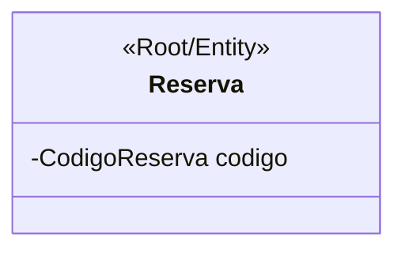
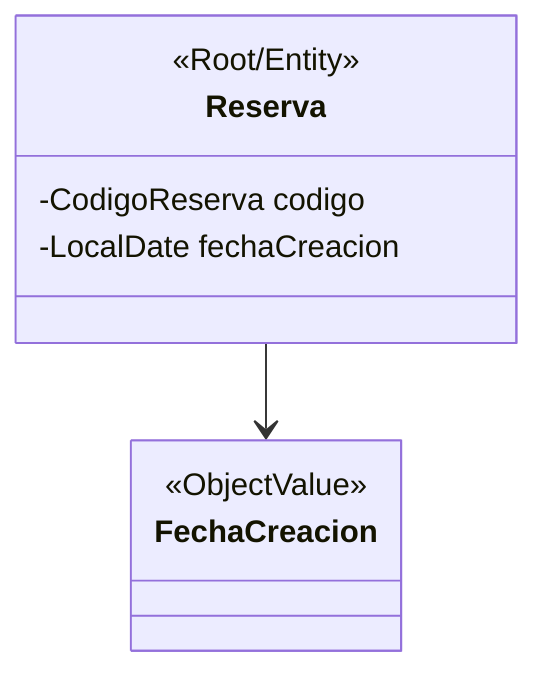
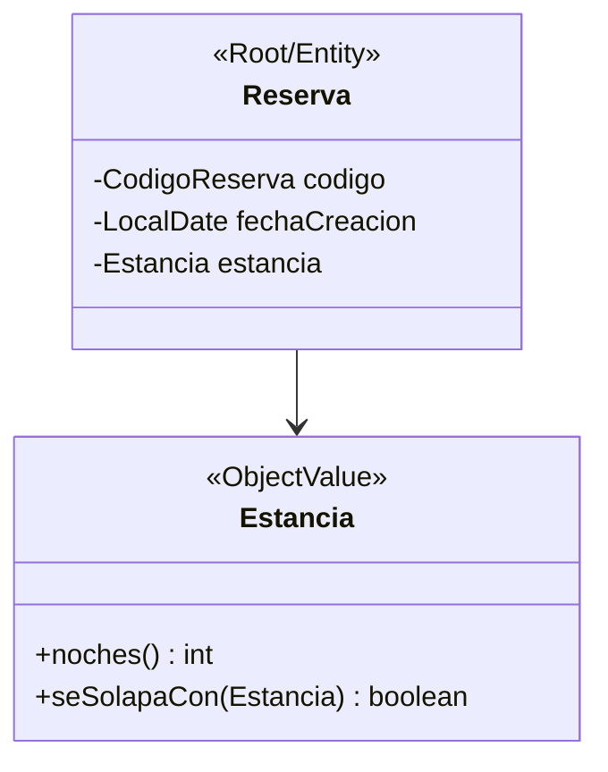
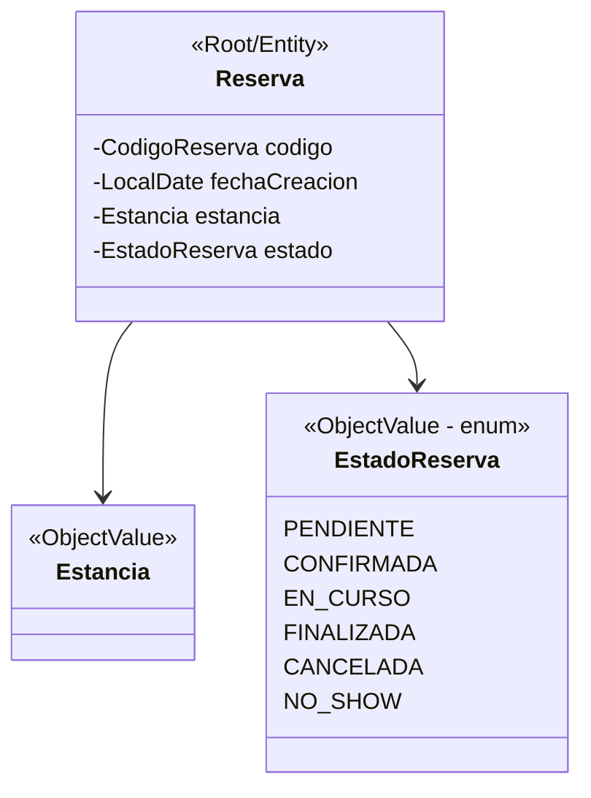
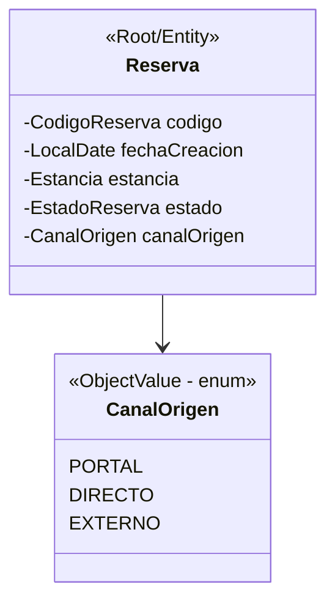
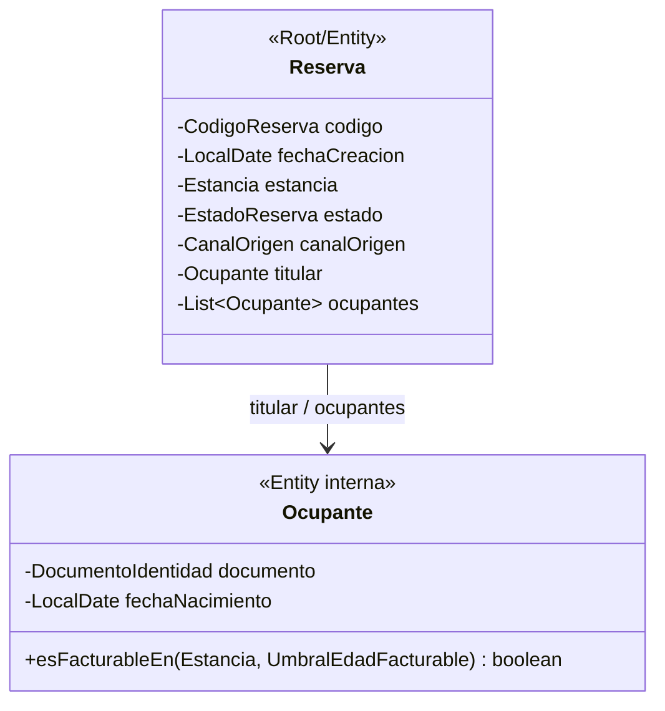
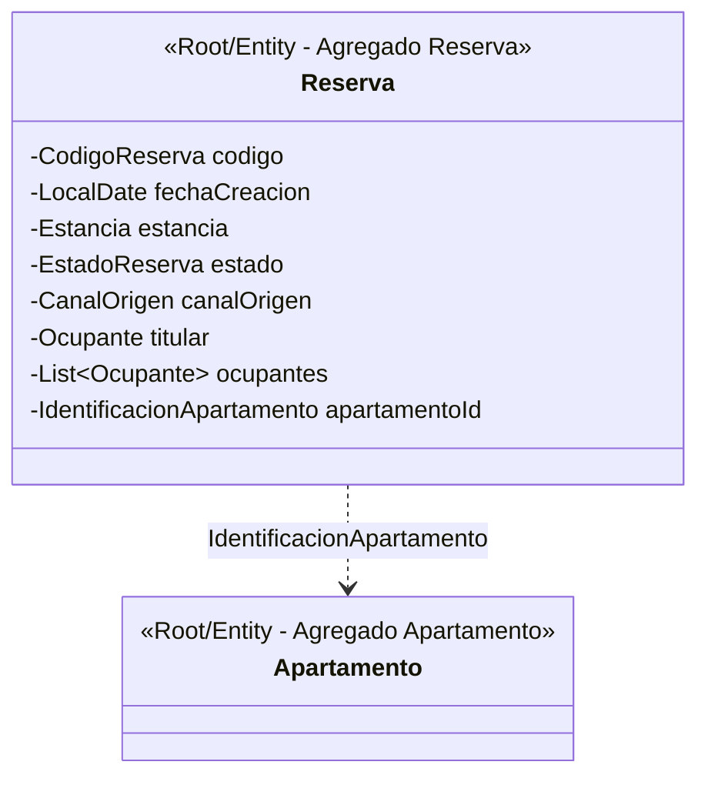
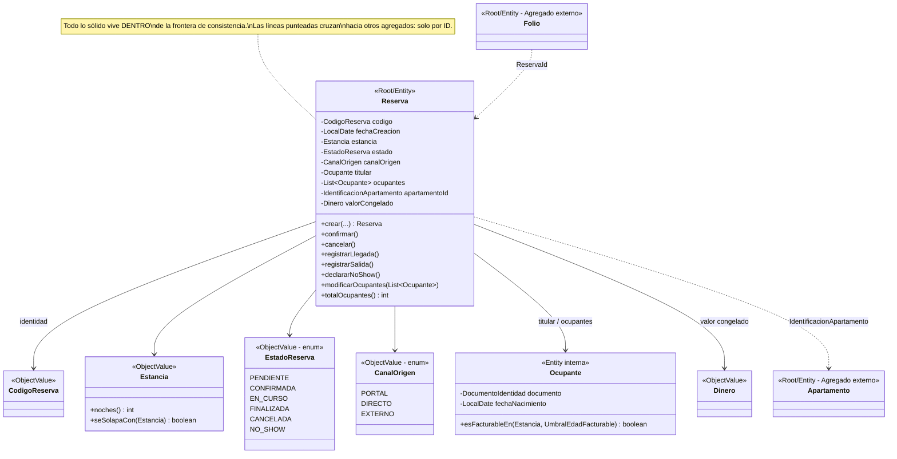

# Construyendo el Agregado `Reserva`, paso a paso

**Curso:** Programación Avanzada — SGA (Sistema de Gestión de Alojamiento)
**Tema:** Agregados y reglas de negocio (Guía 05)

---

## Por qué `Reserva` es un agregado

Antes de meter nada dentro, hay que justificar la raíz misma. Aplicamos los cuatro criterios que ya usamos con `Solicitud` en el material de Candela:

| Criterio | ¿Se cumple en `Reserva`? |
|---|---|
| **1. Identidad propia** | Sí. `CodigoReserva` (`RES-YYYY-NNNNN`) la distingue de cualquier otra reserva, aunque tengan los mismos datos. |
| **2. Tiene un ciclo de vida** | Sí. Sección 8 del proyecto: `PENDIENTE → CONFIRMADA → EN_CURSO → FINALIZADA`, con ramas a `CANCELADA` y `NO_SHOW`. |
| **3. Tiene reglas relacionadas** | Sí. RN-01, RN-02, RN-03, RN-04, RN-08, RN-09, RN-12, RN-14, RN-21, RN-22, entre otras. |
| **4. Coordina otros objetos; otros dependen de ella** | Sí. `Folio` se abre cuando la reserva se crea; el estado operativo del apartamento cambia por sus transiciones; el titular y los ocupantes solo existen *para* esa reserva. |

Con esto confirmado, la pregunta deja de ser "¿es un agregado?" y pasa a ser la que realmente importa en esta guía:

> **¿Qué entra dentro de la frontera de `Reserva`, y qué se queda afuera como agregado propio o como referencia?**

El criterio para decidir, en cada paso, es siempre el mismo (principio de consistencia inmediata de Evans):

> *Si dos cosas deben cambiar juntas, en la misma operación, para que el dominio no quede en un estado inválido — van en el mismo agregado. Si cada una tiene su propio ciclo de vida y puede cambiar sola sin dejar inconsistente a la otra — son agregados distintos, y se referencian por identificador.*

---

## Paso 0 — La raíz sola

Partimos del mínimo: una entidad con identidad, sin nada más.

`CodigoReserva` es un objeto de valor con formato (`record` validado), pero es tan inseparable de la identidad de `Reserva` que no se representa como una "entrada" al agregado sino como su **atributo de identidad**. Es la base del `equals`/`hashCode` de la entidad — no cambia nunca durante la vida de la reserva.

---

## Paso 1 — `FechaCreacion` (Object Value)

**¿Por qué entra?**

- **RN-21**: una reserva `PENDIENTE` que supera el plazo de confirmación se cancela automáticamente. Ese plazo se cuenta **desde la fecha de creación**. Sin este dato, la propia reserva no puede saber si ya venció.
- Es un dato que nace con la reserva y no vuelve a cambiar — exactamente el perfil de un objeto de valor inmutable, capturado una sola vez en el constructor.
- **Detalle de diseño (ya discutido en la Guía 04):** la fecha de creación **llega como parámetro**, no se calcula con `LocalDate.now()` dentro de la clase. Un dominio que le pregunta la hora al sistema operativo no se puede probar de forma determinista.

---

## Paso 2 — `Estancia` (Object Value)

**¿Por qué entra?**

- Sin fechas, `Reserva` no puede proteger **RN-03** (la salida es posterior a la entrada) ni **RN-04** (no se reserva hacia el pasado) en el momento de su propia creación.
- La `Estancia` es la que sabe calcular **noches** y **solapamiento** (definición 3.1) — ese comportamiento tiene que viajar pegado a las dos fechas, o cada consultor tendría que reimplementar la fórmula.
- Ya la clasificamos como VO en el ejercicio de las tres pruebas: si cambian las fechas, no es "la misma estancia corregida", es **otra estancia** que reemplaza a la anterior dentro de la reserva.

---

## Paso 3 — `EstadoReserva` (Object Value cerrado — enum)

**¿Por qué entra?**

- Es la esencia misma del ciclo de vida que justificó a `Reserva` como agregado (criterio 2). El estado **tiene que vivir dentro** de la raíz porque **RN-08** exige que toda transición sea validada en un único punto de entrada — si el estado viviera afuera, cualquier código podría "saltarse" una transición inválida.
- Es un conjunto **cerrado y conocido** de valores (`PENDIENTE`, `CONFIRMADA`, `EN_CURSO`, `FINALIZADA`, `CANCELADA`, `NO_SHOW`) → `enum`, no `String`. El compilador impide valores inexistentes.

---

## Paso 4 — `CanalOrigen` (Object Value cerrado — enum)

**¿Por qué entra?**

- Es un dato que **nace con la reserva y no vuelve a cambiar**: *"El canal es inmutable: una reserva no cambia de canal después de creada"* (glosario). Eso lo hace candidato natural a VO capturado en el constructor, igual que `FechaCreacion`.
- Sostiene reglas propias de la reserva: **RN-01** exige que el solapamiento se valide *sin importar el canal*, y **RN-18/RN-19** (conflicto de canal, idempotencia canal+identificador externo) solo tienen sentido si la reserva sabe por qué canal entró.

---

## Paso 5 — `Titular` y `Ocupante(s)` (Entidades internas)

**¿Por qué entran, y por qué son entidades y no VO?**

- Cada ocupante tiene **identidad propia** dentro del grupo (documento de identidad) y su condición de *facturable* puede evaluarse persona por persona (**RN-06**) — no son intercambiables entre sí, aunque dos ocupantes compartan apellido o fecha de nacimiento.
- Pero **no son un agregado propio**: no tienen sentido ni ciclo de vida fuera de la reserva que los contiene. Nadie "consulta a un ocupante" de forma independiente en el sistema — siempre se accede a través de la reserva. Por eso son **entidades internas**, gobernadas por la raíz, y no un agregado aparte con su propio repositorio.
- El **titular** es, por definición del proyecto (3.2), *"siempre un ocupante facturable de la reserva"* — se modela como una referencia al ocupante que cumple ese rol, no como una clase distinta.
- La colección de ocupantes se expone como **solo lectura** (`List.copyOf`): la única forma de modificar el grupo es un método de negocio de la raíz (`modificarOcupantes(...)`), nunca agregando directamente a la lista.

---

## Paso 6 — La frontera con `Apartamento`: referencia, no objeto

**Esta es la decisión más importante de toda la guía.**

`Apartamento` **no entra** al agregado `Reserva`. En su lugar, `Reserva` guarda únicamente `IdentificacionApartamento` (el identificador).

**¿Por qué?**

Aplicamos el principio 5 de agregados: *"los agregados externos se referencian solo por identificador"*. `Apartamento` ya es, por sí mismo, un agregado con:

- **identidad propia** e independiente de cualquier reserva,
- **su propio ciclo de vida** (se crea, se activa/desactiva, cambia de estado operativo, se elimina lógicamente) — todo eso ocurre sin que exista ninguna reserva sobre él,
- **sus propias invariantes** (RN-02 capacidad, RN-07 bloqueos, RN-11 estado operativo).

Si `Reserva` contuviera el objeto `Apartamento` completo, tendríamos dos problemas:

1. **Dos transacciones disfrazadas de una.** Cambiar la capacidad de un apartamento no debería requerir tocar cada reserva que lo referencia (y el proyecto es explícito: *"cambiar la capacidad de un apartamento no afecta las reservas ya creadas"*, sección 7.3). Si `Reserva` tuviera el objeto completo, esa independencia se rompe.
2. **La regla más importante del sistema (RN-01) no puede vivir dentro de `Reserva` de todas formas.** Verificar que no haya solapamiento exige mirar **todas las demás reservas activas de ese apartamento** — información que ninguna instancia individual de `Reserva` puede conocer sobre sí misma. Por eso esa validación no es una invariante del agregado: es una **precondición externa**, resuelta por un servicio de dominio (`VerificadorDisponibilidad`) *antes* de construir la reserva.

Nota la línea **punteada**, no sólida: representa una referencia por identificador entre dos agregados distintos, exactamente como en tu diagrama de mapa de agregados.

---

## Paso 7 — Lo que se queda deliberadamente afuera

No basta con decir qué entra; hay que dejar explícito qué se descartó y por qué, porque son las preguntas más comunes en sustentación.

| Concepto | ¿Entra a `Reserva`? | Por qué no |
|---|---|---|
| **`Folio`** | No — agregado propio | Tiene sus propias invariantes (RN-15, RN-16, RN-17) y su propio ciclo de vida: se abre al crear la reserva, pero acumula cargos y pagos con reglas que no dependen del estado de la reserva. Se relaciona por `ReservaId`, no se embebe. |
| **`Apartamento`** | No — referencia por ID | Ciclo de vida independiente; ver Paso 6. |
| **`Tarifa` / `Temporada`** | No — ni siquiera por referencia directa | `Reserva` no necesita saber la tarifa vigente por sí sola: el **valor se congela una sola vez al crear la reserva** (RN-22) y ese cálculo lo hace un servicio de dominio que sí conoce `Apartamento`, `Temporada` y `Tarifa`. Lo único que `Reserva` conserva es el **resultado congelado** (`Dinero`), no las reglas para calcularlo. |
| **`PolíticaDeCancelación`** | Solo su **versión congelada** | La política cambia con el tiempo (está versionada), pero cada reserva queda ligada a la versión vigente al momento de su creación (RN-13). `Reserva` no debe referenciar "la política actual del alojamiento" — eso rompería RN-13 apenas la política cambiara. |
| **`Usuario`** | No | Es un concepto de acceso (3.6), no de negocio. El titular puede no tener cuenta. `Reserva` no depende de `Usuario` en absoluto. |

---

## Diagrama final consolidado

Con los siete pasos completos, este es el agregado `Reserva` terminado, incluyendo su frontera con el agregado `Apartamento`:

---

## Tabla resumen — la que se sustenta

| Elemento | Tipo | ¿Dentro del agregado? | Regla que lo justifica |
|---|---|---|---|
| `CodigoReserva` | VO (identidad) | Sí | Base del `equals`/`hashCode` de la entidad |
| `FechaCreacion` | Object Value | Sí | RN-21 (vencimiento del plazo de confirmación) |
| `Estancia` | Object Value | Sí | RN-03, RN-04, definición 3.1 (solapamiento) |
| `EstadoReserva` | Object Value (enum) | Sí | RN-08 (único punto de transición válida) |
| `CanalOrigen` | Object Value (enum) | Sí | Inmutable desde la creación; RN-01, RN-18, RN-19 |
| `Titular` / `Ocupante` | Entidad interna | Sí | RN-06; sin ciclo de vida propio fuera de la reserva |
| `Dinero` (valor congelado) | Object Value | Sí | RN-22 (congelamiento del valor al crear) |
| `Apartamento` | Entidad — agregado propio | **No**, solo `IdentificacionApartamento` | Ciclo de vida independiente; RN-01 necesita ver todas las reservas del apartamento (servicio de dominio) |
| `Folio` | Entidad — agregado propio | **No** | RN-15, RN-16, RN-17; ciclo de vida propio referenciado por `ReservaId` |
| `Tarifa` / `Temporada` | Object Value | **No** (ni por referencia) | Solo se usa una vez, al calcular; el resultado se congela como `Dinero` |
| `PolíticaDeCancelación` | Versionada | **No** (solo su versión congelada) | RN-13 |
| `Usuario` | Entidad — agregado propio | **No** | Concepto de acceso, no de negocio (3.6) |
