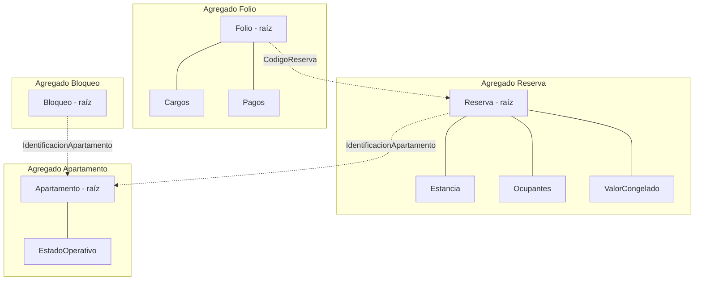

**Programa de Ingeniería de Sistemas y Computación Universidad del Quindío**

**Curso:** Programación Avanzada 
**Guía:** 05 
**Título:** Modelado del Dominio II — Agregados y Reglas de Negocio 
**Duración estimada:** 120 minutos 
**Docente:** Jhan Carlos Martinez Ceballos 
**Proyecto del semestre:** SGA — Sistema de Gestión de Alojamiento

---

# 1. Objetivo

En la Guía 04 identificamos entidades y objetos de valor del SGA y los materializamos en Java. El modelo resultante ya **describe** el dominio, pero todavía no lo **protege**: `Reserva` tiene un estado, pero nada impide que ese estado quede en una combinación que el negocio no acepta. Hoy una reserva puede nacer `PENDIENTE` y quedarse ahí para siempre, porque no existe un solo método que la mueva.

En esta guía daremos el paso que falta:

> pasar de **conceptos materializados** a **comportamiento que garantiza la consistencia del dominio**.

El objetivo **no es introducir infraestructura**, sino aprender a:

- proteger reglas de negocio,
- agrupar correctamente responsabilidades,
- y entender por qué ciertas reglas viven juntas y otras no pueden vivir juntas.

Al terminar, `Reserva` será un agregado completo: no existirá forma de dejarla en un estado que el negocio prohíbe, y quedará respondida la pregunta que dejamos abierta al cerrar la Guía 04 —**¿el `Folio` va dentro de `Reserva` o es un agregado propio?**

> Igual que en la guía anterior, aquí no hay Spring, ni base de datos, ni anotaciones. Solo Java.

---

# 2. Conceptos básicos

1. **Agregado.** Conjunto de objetos del dominio que se tratan como una sola unidad, protegen invariantes y controlan cómo cambia su estado.
2. **Raíz de agregado** (_aggregate root_). La entidad que actúa como único punto de entrada del agregado. Nada de adentro se modifica sin pasar por ella.
3. **Frontera de consistencia.** Lo que debe quedar consistente en una sola operación. Define qué entra y qué sale del agregado.
4. **Invariante.** Regla que debe ser **siempre** verdadera y que el agregado puede sostener **con sus propios datos**.
5. **Precondición externa.** Condición que debe cumplirse **antes** de invocar una operación, pero que depende del estado de otro agregado. No es una invariante.
6. **Servicio de dominio.** Clase del dominio que contiene una regla que no pertenece naturalmente a ninguna entidad, o que coordina varias.
7. **Repositorio (contrato).** Interfaz declarada en el dominio que expresa **qué datos necesita**, sin decir de dónde salen. Su implementación llega en la Guía 10.

---

# 3. Contextualización teórica

## 3.1 ¿Qué es un agregado?

Un **agregado** es un conjunto de objetos del dominio (entidades y objetos de valor) que:

- se tratan como una sola unidad,
- protegen reglas de negocio importantes (invariantes),
- y controlan cómo se modifica su estado.

Cada agregado tiene una **raíz**, que controla el acceso, y uno o más objetos que dependen de ella.

> El agregado existe para **evitar estados inválidos** del dominio.

**Referencia:** Evans, E. (2003). _Domain-Driven Design_, capítulo 6: "Aggregates".

## 3.2 ¿Por qué agregados? El problema concreto del SGA

**Problema:** sin agregados, las operaciones pueden violar invariantes desde cualquier punto del sistema.

El proyecto exige tres cosas al registrar la llegada de un grupo (7.6): que la reserva pase a `EN_CURSO`, que el apartamento pase a `OCUPADO`, y que ambas cosas ocurran solo si la reserva estaba `CONFIRMADA`. Si esas tres cosas se coordinan desde afuera, nada garantiza que ocurran juntas ni en el orden correcto.

```java
// Problema: acceso directo sin control
class ReservaService {
    void registrarLlegada(String codigo) {
        Reserva reserva = repo.buscar(codigo);
        Apartamento apartamento = apartamentoRepo.buscar(reserva.getApartamento());

        // Se puede ocupar el apartamento sin mover la reserva
        apartamento.setEstadoOperativo(EstadoOperativo.OCUPADO);

        // O mover la reserva sin verificar de qué estado viene
        reserva.setEstado(EstadoReserva.EN_CURSO);   // ¿venía de CANCELADA? nadie lo sabe
    }
}
```

Este código tiene tres fallas, y ninguna es técnica:

1. La regla RN-08 ("solo se transita entre los estados de la sección 8") vive fuera del dominio, así que se puede olvidar.
2. Nada valida si la transición es legal: una reserva `CANCELADA` puede volver a `EN_CURSO`.
3. La reserva y el apartamento pueden quedar desincronizados sin que nadie lo note: apartamento `OCUPADO` con la reserva `CANCELADA`.

La solución no es agregar más validaciones en el servicio. Es **mover la frontera**: que la única forma de cambiar el estado de una reserva sea a través de la propia reserva, y que la regla viaje con el dato que protege.

## 3.3 Principios de agregados

1. **Límite de consistencia:** todo lo que está dentro del agregado debe ser consistente al terminar cada operación.
2. **Raíz única:** solo una entidad es la raíz.
3. **Acceso controlado:** solo la raíz es accesible desde fuera.
4. **Transacciones:** un agregado = una transacción.
5. **Referencias:** los agregados externos se referencian **solo por identificador**.

## 3.4 La Reserva como agregado

En el SGA, la **reserva** es el candidato evidente a raíz de agregado:

- tiene identidad propia (`CodigoReserva`),
- cambia de estado siguiendo el ciclo de vida de la sección 8,
- concentra las reglas más importantes del negocio (RN-03, RN-08, RN-09, RN-10, RN-12, RN-14, RN-22),
- y coordina otros conceptos: la estancia, la composición del grupo, el valor congelado y la política congelada.

Todas las modificaciones relevantes a una reserva deben pasar por su raíz.

## 3.5 ¿Qué queda dentro y qué queda fuera?

Decidir el límite del agregado es la decisión de diseño más importante de esta guía. El criterio es la **consistencia inmediata**: si dos cosas deben cambiar juntas o no cambiar, van en el mismo agregado.

|Concepto del SGA|¿Dentro del agregado `Reserva`?|Por qué|
|---|---|---|
|`Estancia`, `EstadoReserva`, `CanalOrigen`|Sí|Son objetos de valor que describen a la reserva y cambian con ella|
|Lista de `Ocupante`|Sí|La composición del grupo solo tiene sentido dentro de una reserva y se valida con ella (RN-02, RN-06)|
|`ValorCongelado` (desglose noche por noche) y `VersionPolitica`|Sí|RN-22: se congelan **al crear la reserva** y solo cambian por modificación explícita de ella|
|`Apartamento`|**No**|Tiene su propio ciclo de vida: se crea, cambia de estado operativo y se desactiva sin que exista ninguna reserva|
|`Folio`|**No**|Ver 3.6|
|`Bloqueo`|**No**|Es una decisión administrativa sobre el apartamento, independiente de cualquier reserva|
|`Temporada`, `Tarifa`, `PoliticaCancelacion`|**No**|Son configuración del alojamiento, con su propio ciclo de vida y su propio versionado|

**Consecuencia inmediata y cambio respecto de la Guía 04.** En la guía anterior `Reserva` guardaba el objeto `Apartamento` completo. Aquí lo cambiamos por su identificador:

```java
// Antes (Guía 04)
private Apartamento apartamento;

// Ahora: referencia entre agregados por identificador (principio 5)
private final IdentificacionApartamento apartamento;
```

No es un capricho de purista. Guardar el objeto invita a escribir `apartamento.getEstadoOperativo()` dentro de la reserva, y ahí empieza el problema que estudiaremos en la sección 4.5.

## 3.6 La pregunta abierta: ¿el Folio va dentro de la Reserva?

Al final de la Guía 04 quedó planteada. Los dos caminos son defendibles; este curso toma una decisión y la sustenta.

|Argumento a favor de meterlo dentro|Argumento a favor de dejarlo afuera|
|---|---|
|Un folio pertenece a **una sola reserva** (7.7), nunca se comparte|Se abre con la reserva pero **sigue vivo después**: se pagan saldos de reservas ya finalizadas|
|Cancelar una reserva genera cargos en el folio|Sus reglas son de otra naturaleza: RN-15, RN-16 (nada se edita ni se borra) y RN-17 (cierre con autorización)|
|Suena natural decir "el folio de la reserva"|Un pago no cambia el estado de la reserva, y un cambio de estado no invalida un pago ya registrado|

**Decisión del curso: `Folio` es un agregado aparte**, con `CodigoReserva` como referencia. La razón decisiva es la frontera de consistencia: **no existe ninguna regla que exija que el estado de la reserva y el saldo del folio cambien en el mismo instante.** Si existiera —por ejemplo, "una reserva no puede confirmarse con saldo distinto de cero"— habría que revisar la decisión. En su lugar, el proyecto exige lo contrario: el folio se abre antes de la llegada precisamente para poder registrar el anticipo por separado (7.7).

> Cada equipo puede sostener la decisión contraria **si la argumenta con el criterio de consistencia inmediata**. Lo que no se acepta es no haberlo pensado.

## 3.7 El mapa de agregados del SGA



Las flechas punteadas son referencias **por identificador**. Ningún agregado guarda una referencia al objeto de otro.

---

# 4. Parte 1: Las reglas como comportamiento

En la Guía 04 identificamos reglas. Aquí las convertimos en código. La traducción sigue un patrón fijo:

|Tipo de regla|Traducción en Java|Ejemplo en el SGA|
|---|---|---|
|"X solo puede ocurrir si el estado es Y"|Verificación al inicio del método, antes de tocar el estado|RN-10: no hay registro si la reserva no está `CONFIRMADA`|
|"X requiere que exista Z"|Verificación de nulidad con mensaje del negocio|RN-09: no se confirma sin hora estimada de llegada|
|"de A solo se puede pasar a B"|Máquina de estados en el `enum`|RN-08: transiciones de la sección 8|
|"esto queda congelado al crearse"|Campo asignado en la creación y sin método que lo cambie salvo la modificación explícita|RN-22: valor y política|
|"toda acción queda registrada"|El propio método registra el evento antes de terminar|Trazabilidad de la cancelación (2.5)|

## 4.1 Las transiciones como conocimiento del enum

El ciclo de vida definido en la sección 8 del proyecto es:

```
PENDIENTE ──► CONFIRMADA ──► EN_CURSO ──► FINALIZADA
    │              │
    ▼              ├──► CANCELADA
CANCELADA          └──► NO_SHOW
```

Ese conocimiento no pertenece a `Reserva`: pertenece al concepto de estado. Enriquecemos entonces el `enum` de la Guía 04, sin tocar lo que ya tenía:

```java
package co.edu.uniquindio.sga.domain.valueobject;

/**
 * Estados del ciclo de vida de una reserva (sección 8 del proyecto).
 */
public enum EstadoReserva {

    PENDIENTE(true),
    CONFIRMADA(true),
    EN_CURSO(true),
    FINALIZADA(false),
    CANCELADA(false),
    NO_SHOW(false);

    private final boolean activa;

    EstadoReserva(boolean activa) {
        this.activa = activa;
    }

    /** Reservas activas: PENDIENTE, CONFIRMADA y EN_CURSO. */
    public boolean esActiva() {
        return activa;
    }

    /** FINALIZADA, CANCELADA y NO_SHOW son estados terminales. */
    public boolean esTerminal() {
        return !activa;
    }

    /** RN-12: en este dominio solo las reservas activas retienen noches. */
    public boolean retieneDisponibilidad() {
        return activa;
    }

    /**
     * RN-08: define el ciclo de vida válido de una reserva.
     * El conocimiento de las transiciones vive aquí, no disperso en if.
     */
    public boolean puedeTransicionarA(EstadoReserva siguiente) {
        return switch (this) {
            case PENDIENTE  -> siguiente == CONFIRMADA || siguiente == CANCELADA;
            case CONFIRMADA -> siguiente == EN_CURSO
                            || siguiente == CANCELADA
                            || siguiente == NO_SHOW;
            case EN_CURSO   -> siguiente == FINALIZADA;
            case FINALIZADA, CANCELADA, NO_SHOW -> false;   // estados terminales
        };
    }
}
```

El `switch` sobre un `enum` es exhaustivo: si mañana el negocio agrega un estado nuevo, **el código deja de compilar** hasta que alguien decida a dónde puede transicionar. Esa es la ventaja del `enum` sobre el `String`.

Observe además una consecuencia gratuita: la regla "la salida anticipada de un grupo ya registrado **no es una cancelación**" (7.5) queda garantizada sin escribir una sola línea extra, porque `EN_CURSO` solo puede ir a `FINALIZADA`.

## 4.2 El valor congelado: una regla que se protege con la forma del dato

RN-22 y la definición 3.5 exigen que el valor y la política queden **congelados** al crear la reserva. La forma correcta de garantizar eso no es un comentario ni una convención de equipo: es un objeto de valor inmutable con su desglose adentro.

```java
package co.edu.uniquindio.sga.domain.valueobject;

import java.time.LocalDate;

import co.edu.uniquindio.sga.domain.exception.ReglaDominioException;

/**
 * Una línea del desglose noche por noche (RN-05, 7.4).
 * Inmutable: una noche liquidada no se recalcula, se reemplaza el desglose completo.
 */
public record CargoNoche(
        LocalDate noche,
        String temporada,
        Dinero tarifaPorOcupante,
        int ocupantesFacturables) {

    public CargoNoche {
        if (noche == null) {
            throw new ReglaDominioException("El cargo de la noche debe indicar la fecha");
        }
        if (temporada == null || temporada.isBlank()) {
            throw new ReglaDominioException("Toda noche liquidada pertenece a una temporada");
        }
        if (tarifaPorOcupante == null || tarifaPorOcupante.esNegativo()) {
            throw new ReglaDominioException("La tarifa de la noche no puede ser negativa");
        }
        if (ocupantesFacturables < 0) {
            throw new ReglaDominioException("Los ocupantes facturables no pueden ser negativos");
        }
    }

    /** RN-05: tarifa de la noche por el número de ocupantes facturables. */
    public Dinero subtotal() {
        return tarifaPorOcupante.por(ocupantesFacturables);
    }
}
```

```java
package co.edu.uniquindio.sga.domain.valueobject;

import java.util.List;

import co.edu.uniquindio.sga.domain.exception.ReglaDominioException;

/**
 * Valor de una estancia con su desglose, congelado al crear la reserva (RN-22, 3.5).
 * El redondeo se aplica AL FINAL del cálculo, nunca noche por noche (3.4).
 */
public record ValorCongelado(List<CargoNoche> detalle) {

    public ValorCongelado {
        if (detalle == null || detalle.isEmpty()) {
            throw new ReglaDominioException("El valor de la reserva debe tener desglose por noche");
        }
        detalle = List.copyOf(detalle);   // copia inmutable: el desglose no se altera después
    }

    public Dinero total() {
        return detalle.stream()
                .map(CargoNoche::subtotal)
                .reduce(Dinero.CERO, Dinero::mas);
    }

    public int noches() {
        return detalle.size();
    }
}
```

```java
package co.edu.uniquindio.sga.domain.valueobject;

import co.edu.uniquindio.sga.domain.exception.ReglaDominioException;

/**
 * Referencia a la versión de la política de cancelación vigente al crear la reserva.
 * Se guarda el identificador de la versión, no el objeto: la política es otro agregado (3.5, RN-13).
 */
public record VersionPolitica(int numero) {

    public VersionPolitica {
        if (numero < 1) {
            throw new ReglaDominioException("La versión de la política debe ser mayor que cero");
        }
    }
}
```

> **Por qué `VersionPolitica` y no `PoliticaCancelacion`.** Si la reserva guardara el objeto de la política, un cambio administrativo posterior podría propagarse a reservas ya creadas y RN-13 quedaría rota sin que nadie lo note. Guardando la **versión**, la reserva conserva para siempre el número de la política que la rige, y el cálculo de la retención se hace consultando esa versión histórica.

## 4.3 El historial de la reserva

El riesgo 2.5 menciona explícitamente "cancelaciones sin registro de la política aplicada". Para evitarlo, el agregado registra cada cambio de estado en un historial **inmutable y cronológico**. Como cada evento es inmutable y no tiene identidad propia fuera de su reserva, es un objeto de valor:

```java
package co.edu.uniquindio.sga.domain.valueobject;

import java.time.LocalDateTime;

import co.edu.uniquindio.sga.domain.exception.ReglaDominioException;

/**
 * Registro inmutable de una acción ocurrida sobre una reserva.
 * Nunca se modifica ni se elimina: solo se agrega.
 */
public record EventoReserva(
        LocalDateTime momento,
        String accion,
        String autor,
        EstadoReserva estadoAnterior,
        EstadoReserva estadoNuevo,
        String observacion) {

    public EventoReserva {
        if (momento == null) {
            throw new ReglaDominioException("El evento debe tener fecha y hora");
        }
        if (accion == null || accion.isBlank()) {
            throw new ReglaDominioException("El evento debe indicar la acción realizada");
        }
        if (autor == null || autor.isBlank()) {
            throw new ReglaDominioException("El evento debe indicar quién ejecutó la acción");
        }
    }
}
```

> **`autor` es un texto, no un `Usuario`.** La definición 3.6 del proyecto es explícita: *"el dominio no depende del concepto de usuario; la autenticación pertenece a la infraestructura"*. El dominio necesita saber **quién** hizo el cambio para poder auditarlo, no necesita conocer credenciales ni roles. Quien invoque la operación pasará el nombre o el documento; la capa de seguridad (Guía 12) se encargará de que ese dato sea confiable.

## 4.4 El agregado Reserva completo

Esta es la `Reserva` de la Guía 04 con su comportamiento. Compare con la versión anterior: los atributos son casi los mismos; lo que se agrega es la protección.

```java
package co.edu.uniquindio.sga.domain.entity;

import java.time.LocalDate;
import java.time.LocalDateTime;
import java.time.LocalTime;
import java.util.ArrayList;
import java.util.Collections;
import java.util.List;

import co.edu.uniquindio.sga.domain.exception.ReglaDominioException;
import co.edu.uniquindio.sga.domain.valueobject.CanalOrigen;
import co.edu.uniquindio.sga.domain.valueobject.CodigoReserva;
import co.edu.uniquindio.sga.domain.valueobject.Dinero;
import co.edu.uniquindio.sga.domain.valueobject.Estancia;
import co.edu.uniquindio.sga.domain.valueobject.EstadoReserva;
import co.edu.uniquindio.sga.domain.valueobject.EventoReserva;
import co.edu.uniquindio.sga.domain.valueobject.IdentificacionApartamento;
import co.edu.uniquindio.sga.domain.valueobject.PlazoConfirmacion;
import co.edu.uniquindio.sga.domain.valueobject.ValorCongelado;
import co.edu.uniquindio.sga.domain.valueobject.VersionPolitica;

/**
 * Raíz del agregado Reserva.
 *
 * Invariantes que garantiza:
 *  - toda reserva nace en estado PENDIENTE;
 *  - solo se transita entre los estados permitidos por la sección 8 (RN-08);
 *  - una reserva en estado terminal no admite ninguna modificación;
 *  - no se confirma una reserva sin hora estimada de llegada (RN-09);
 *  - no se registra la llegada antes de la fecha de entrada (RN-10);
 *  - el valor y la política quedan congelados y solo cambian por modificación explícita (RN-22);
 *  - toda modificación revalida y recalcula, y produce el ajuste correspondiente (RN-14);
 *  - el grupo de ocupantes no puede alterarse desde fuera del agregado;
 *  - toda acción que cambia el estado queda registrada en el historial.
 *
 * NO garantiza (ver sección 4.5):
 *  - que el apartamento tenga capacidad suficiente (RN-02);
 *  - que no exista solapamiento con otras reservas o bloqueos (RN-01, RN-07, RN-20);
 *  - que el apartamento esté PREPARADO al registrar la llegada (RN-11);
 *  - que el folio esté cerrado al registrar la salida (7.6);
 *  - que quien ejecuta la operación tenga permiso para hacerlo.
 */
public class Reserva {

    private final CodigoReserva codigo;                      // identidad
    private final CanalOrigen canalOrigen;                   // por dónde entró: no cambia nunca
    private final LocalDateTime creadaEn;
    private final Ocupante titular;
    private final IdentificacionApartamento apartamento;     // referencia a OTRO agregado
    private final VersionPolitica politica;                  // RN-13: congelada de por vida
    private final List<EventoReserva> historial = new ArrayList<>();

    private Estancia estancia;
    private List<Ocupante> ocupantes;
    private EstadoReserva estado;
    private LocalTime horaEstimadaLlegada;
    private ValorCongelado valor;

    private Reserva(CodigoReserva codigo, IdentificacionApartamento apartamento,
                    Estancia estancia, Ocupante titular, List<Ocupante> ocupantes,
                    CanalOrigen canalOrigen, ValorCongelado valor,
                    VersionPolitica politica, LocalDateTime creadaEn) {
        this.codigo = codigo;
        this.apartamento = apartamento;
        this.estancia = estancia;
        this.titular = titular;
        this.ocupantes = List.copyOf(ocupantes);
        this.canalOrigen = canalOrigen;
        this.valor = valor;
        this.politica = politica;
        this.creadaEn = creadaEn;
        this.estado = EstadoReserva.PENDIENTE;               // toda reserva nace PENDIENTE
    }

    /**
     * Única puerta de entrada para crear una reserva.
     * El valor ya llega calculado y la disponibilidad ya fue verificada: ver sección 4.5.
     */
    public static Reserva crear(CodigoReserva codigo, IdentificacionApartamento apartamento,
                                Estancia estancia, Ocupante titular, List<Ocupante> ocupantes,
                                CanalOrigen canalOrigen, ValorCongelado valor,
                                VersionPolitica politica, LocalDateTime ahora) {

        if (codigo == null) {
            throw new ReglaDominioException("La reserva debe tener un código");
        }
        if (apartamento == null) {
            throw new ReglaDominioException("La reserva debe indicar el apartamento");
        }
        if (estancia == null) {
            throw new ReglaDominioException("La reserva debe tener una estancia");
        }
        if (titular == null) {
            throw new ReglaDominioException("La reserva debe tener un titular");
        }
        if (canalOrigen == null) {
            throw new ReglaDominioException("La reserva debe indicar su canal de origen");
        }
        if (valor == null || politica == null) {
            throw new ReglaDominioException(
                "La reserva debe nacer con su valor y su política congelados");
        }
        if (ocupantes == null || ocupantes.isEmpty()) {
            throw new ReglaDominioException("La reserva debe tener al menos un ocupante");
        }
        if (!ocupantes.contains(titular)) {
            throw new ReglaDominioException("El titular debe ser uno de los ocupantes");
        }
        if (ocupantes.stream().distinct().count() != ocupantes.size()) {
            throw new ReglaDominioException("No se puede repetir un ocupante en la reserva");
        }
        // RN-04: no se crean reservas hacia el pasado
        if (estancia.fechaEntrada().isBefore(ahora.toLocalDate())) {
            throw new ReglaDominioException(
                "La fecha de entrada no puede ser anterior a la fecha actual");
        }
        // El desglose congelado debe corresponder a la estancia que se está reservando
        if (valor.noches() != estancia.noches()) {
            throw new ReglaDominioException(
                "El desglose del valor no corresponde al número de noches de la estancia");
        }

        Reserva reserva = new Reserva(codigo, apartamento, estancia, titular, ocupantes,
                                      canalOrigen, valor, politica, ahora);
        reserva.registrarEvento("CREACION", titular.getNombre(), null,
                EstadoReserva.PENDIENTE, "Reserva creada por el canal " + canalOrigen);
        return reserva;
    }

    // ---------- Comportamiento del negocio ----------

    /** RN-09: la hora estimada de llegada es requisito para confirmar. */
    public void indicarHoraEstimadaLlegada(LocalTime hora, String autor) {
        verificarQueNoEsteTerminada();

        if (hora == null) {
            throw new ReglaDominioException("Debe indicarse la hora estimada de llegada");
        }
        this.horaEstimadaLlegada = hora;
        registrarEvento("HORA_LLEGADA", autor, this.estado, this.estado,
                "Hora estimada de llegada: " + hora);
    }

    /**
     * RN-09: solo una reserva PENDIENTE con hora estimada de llegada puede confirmarse.
     * La exigencia de anticipo (L-11) depende del folio: se verifica antes de llegar aquí.
     */
    public void confirmar(String autor, LocalDateTime ahora) {
        verificarQueNoEsteTerminada();

        if (this.horaEstimadaLlegada == null) {
            throw new ReglaDominioException(
                "No se puede confirmar una reserva sin hora estimada de llegada");
        }

        EstadoReserva anterior = this.estado;
        verificarTransicion(EstadoReserva.CONFIRMADA);

        this.estado = EstadoReserva.CONFIRMADA;
        registrarEvento("CONFIRMACION", autor, anterior, this.estado, "Reserva confirmada", ahora);
    }

    /**
     * RN-12: la cancelación libera las noches de inmediato, porque CANCELADA no es un
     * estado activo. RN-13: la retención se calcula con la política congelada, y ese
     * cálculo lo hace un servicio de dominio (sección 6).
     */
    public void cancelar(String motivo, String autor, LocalDateTime ahora) {
        verificarQueNoEsteTerminada();

        if (motivo == null || motivo.isBlank()) {
            throw new ReglaDominioException("Toda cancelación debe registrar un motivo");
        }

        EstadoReserva anterior = this.estado;
        verificarTransicion(EstadoReserva.CANCELADA);

        this.estado = EstadoReserva.CANCELADA;
        registrarEvento("CANCELACION", autor, anterior, this.estado,
                motivo + " | política aplicada: versión " + politica.numero(), ahora);
    }

    /**
     * RN-21: una reserva PENDIENTE que supera el plazo de confirmación se cancela sola.
     * El disparo automático es responsabilidad de la infraestructura (Guía 09);
     * la regla de cuándo procede es del dominio.
     */
    public void vencer(PlazoConfirmacion plazo, LocalDateTime ahora) {
        if (this.estado != EstadoReserva.PENDIENTE) {
            throw new ReglaDominioException("Solo vence una reserva PENDIENTE");
        }
        if (!plazo.venceAntesDe(this.creadaEn, ahora)) {
            throw new ReglaDominioException("La reserva todavía está dentro del plazo de confirmación");
        }

        EstadoReserva anterior = this.estado;
        this.estado = EstadoReserva.CANCELADA;
        registrarEvento("VENCIMIENTO", "SISTEMA", anterior, this.estado,
                "Cancelada por vencimiento del plazo de confirmación", ahora);
    }

    /**
     * RN-10: no se registra la llegada antes de la fecha de entrada, ni sobre una
     * reserva que no esté CONFIRMADA. Que el apartamento esté PREPARADO (RN-11)
     * NO se verifica aquí: ver sección 4.5.
     */
    public void registrarLlegada(String autor, LocalDateTime ahora) {
        verificarQueNoEsteTerminada();

        if (ahora.toLocalDate().isBefore(estancia.fechaEntrada())) {
            throw new ReglaDominioException(
                "No se puede registrar la llegada antes de la fecha de entrada");
        }

        EstadoReserva anterior = this.estado;
        verificarTransicion(EstadoReserva.EN_CURSO);

        this.estado = EstadoReserva.EN_CURSO;
        registrarEvento("REGISTRO", autor, anterior, this.estado, "El grupo tomó el apartamento", ahora);
    }

    /**
     * El cierre del folio es requisito para completar la salida (7.6), pero el folio
     * es otro agregado: esa verificación ocurre antes de llegar aquí.
     */
    public void registrarSalida(String autor, LocalDateTime ahora) {
        verificarQueNoEsteTerminada();

        EstadoReserva anterior = this.estado;
        verificarTransicion(EstadoReserva.FINALIZADA);

        this.estado = EstadoReserva.FINALIZADA;
        registrarEvento("SALIDA", autor, anterior, this.estado, "El grupo salió del apartamento", ahora);
    }

    /** El no-show solo procede a partir de la hora límite del día de entrada (L-15). */
    public void declararNoShow(LocalTime horaLimite, String autor, LocalDateTime ahora) {
        verificarQueNoEsteTerminada();

        if (horaLimite == null) {
            throw new ReglaDominioException("Debe indicarse la hora límite de no-show");
        }
        LocalDateTime limite = estancia.fechaEntrada().atTime(horaLimite);
        if (ahora.isBefore(limite)) {
            throw new ReglaDominioException(
                "No se puede declarar no-show antes de la hora límite del día de entrada");
        }

        EstadoReserva anterior = this.estado;
        verificarTransicion(EstadoReserva.NO_SHOW);

        this.estado = EstadoReserva.NO_SHOW;
        registrarEvento("NO_SHOW", autor, anterior, this.estado,
                "El titular no se presentó | política aplicada: versión " + politica.numero(), ahora);
    }

    /**
     * RN-14: toda modificación recalcula el valor y produce un ajuste.
     * RN-22: la política congelada NO se recalcula.
     *
     * El nuevo valor llega ya calculado y la nueva disponibilidad ya verificada
     * (sección 4.5). El agregado devuelve el ajuste; registrarlo en el folio es
     * responsabilidad del caso de uso (Guía 06).
     *
     * @return diferencia entre el nuevo valor y el anterior; puede ser negativa
     */
    public Dinero modificarEstancia(Estancia nuevaEstancia, ValorCongelado nuevoValor,
                                    String autor, LocalDateTime ahora) {
        verificarQueNoEsteTerminada();

        if (this.estado == EstadoReserva.EN_CURSO) {
            throw new ReglaDominioException("No se puede modificar una reserva ya iniciada");
        }
        if (nuevaEstancia == null || nuevoValor == null) {
            throw new ReglaDominioException("La modificación requiere la nueva estancia y su valor");
        }
        if (nuevoValor.noches() != nuevaEstancia.noches()) {
            throw new ReglaDominioException(
                "El desglose del valor no corresponde al número de noches de la estancia");
        }

        Dinero ajuste = nuevoValor.total().menos(this.valor.total());

        this.estancia = nuevaEstancia;
        this.valor = nuevoValor;

        registrarEvento("MODIFICACION", autor, this.estado, this.estado,
                "Nueva estancia " + nuevaEstancia.fechaEntrada() + " a "
                        + nuevaEstancia.fechaSalida() + " | ajuste: " + ajuste.valor(), ahora);
        return ajuste;
    }

    // ---------- Verificaciones internas ----------

    private void verificarQueNoEsteTerminada() {
        if (this.estado.esTerminal()) {
            throw new ReglaDominioException(
                "Una reserva en estado " + this.estado + " no admite modificaciones");
        }
    }

    private void verificarTransicion(EstadoReserva siguiente) {
        if (!this.estado.puedeTransicionarA(siguiente)) {
            throw new ReglaDominioException(
                "No se puede pasar de " + this.estado + " a " + siguiente);
        }
    }

    /**
     * Único punto donde se agregan eventos al historial.
     * Es privado: garantiza que ninguna acción externa altere la trazabilidad.
     */
    private void registrarEvento(String accion, String autor, EstadoReserva anterior,
                                 EstadoReserva nuevo, String observacion, LocalDateTime ahora) {
        this.historial.add(new EventoReserva(ahora, accion, autor, anterior, nuevo, observacion));
    }

    private void registrarEvento(String accion, String autor, EstadoReserva anterior,
                                 EstadoReserva nuevo, String observacion) {
        registrarEvento(accion, autor, anterior, nuevo, observacion, this.creadaEn);
    }

    // ---------- Consultas ----------

    /** Lista de solo lectura: sin esto, quien la reciba podría alterar la trazabilidad. */
    public List<EventoReserva> obtenerHistorial() {
        return Collections.unmodifiableList(historial);
    }

    /** Lista inmutable: cambiar el grupo exige pasar por el comportamiento del dominio. */
    public List<Ocupante> getOcupantes() {
        return ocupantes;
    }

    public int totalOcupantes() {
        return ocupantes.size();
    }

    public CodigoReserva getCodigo() {
        return codigo;
    }

    public IdentificacionApartamento getApartamento() {
        return apartamento;
    }

    public EstadoReserva getEstado() {
        return estado;
    }

    public Estancia getEstancia() {
        return estancia;
    }

    public Ocupante getTitular() {
        return titular;
    }

    public ValorCongelado getValor() {
        return valor;
    }

    public VersionPolitica getPolitica() {
        return politica;
    }

    public CanalOrigen getCanalOrigen() {
        return canalOrigen;
    }

    public LocalDateTime getCreadaEn() {
        return creadaEn;
    }

    public LocalTime getHoraEstimadaLlegada() {
        return horaEstimadaLlegada;
    }

    @Override
    public boolean equals(Object o) {
        if (this == o) {
            return true;
        }
        if (!(o instanceof Reserva otra)) {
            return false;
        }
        return this.codigo.equals(otra.codigo);
    }

    @Override
    public int hashCode() {
        return codigo.hashCode();
    }
}
```

El objeto de valor que faltaba:

```java
package co.edu.uniquindio.sga.domain.valueobject;

import java.time.LocalDateTime;

import co.edu.uniquindio.sga.domain.exception.ReglaDominioException;

/**
 * Plazo, en horas, para confirmar una reserva PENDIENTE (L-14, RN-21).
 * Es configuración del alojamiento, no una constante del código.
 */
public record PlazoConfirmacion(int horas) {

    public PlazoConfirmacion {
        if (horas < 1) {
            throw new ReglaDominioException("El plazo de confirmación debe ser de al menos una hora");
        }
    }

    public boolean venceAntesDe(LocalDateTime creacion, LocalDateTime momento) {
        return momento.isAfter(creacion.plusHours(horas));
    }
}
```

> **Un cambio pequeño con una razón grande.** En la Guía 04 la reserva guardaba `LocalDate fechaCreacion`. RN-21 mide el plazo **en horas**, y una fecha sin hora no alcanza para decidir si un plazo de 24 horas se cumplió. Por eso el campo pasa a `LocalDateTime creadaEn`. **La precisión del tipo la define la regla que lo usa**, no la comodidad de quien lo escribe.

## 4.5 Lo que este código garantiza

Observe cómo cada decisión de código sostiene una invariante:

|Decisión en el código|Invariante que protege|
|---|---|
|`estado` inicializado en el constructor privado|Toda reserva nace `PENDIENTE`|
|`verificarQueNoEsteTerminada()` al inicio de cada método|Una reserva terminal no se modifica|
|`verificarTransicion(...)` antes de asignar el estado|RN-08: solo transiciones de la sección 8|
|`valor` y `politica` sin _setter_; `politica` además `final`|RN-22 y RN-13: congelamiento|
|`registrarEvento(...)` privado, invocado por cada operación|Toda acción queda trazada|
|`Collections.unmodifiableList(historial)`|El historial no se altera desde fuera|
|`List.copyOf(ocupantes)`|El grupo no se altera saltándose la validación de capacidad|
|Validaciones antes de cualquier asignación|Si la regla falla, el estado **no cambia**|

Este último punto merece atención. Todas las validaciones ocurren **antes** de modificar campos. Si una regla falla, el objeto queda exactamente como estaba. Un agregado que valida a mitad de camino puede quedar en un estado peor que el inicial.

Puesto a prueba:

```java
Reserva reserva = Reserva.crear(
        new CodigoReserva("RES-2026-00042"),
        new IdentificacionApartamento("APT-301"),
        new Estancia(LocalDate.of(2026, 12, 10), LocalDate.of(2026, 12, 12)),
        titular, List.of(titular, hijo),
        CanalOrigen.PORTAL, valorCongelado, new VersionPolitica(3),
        LocalDateTime.of(2026, 11, 1, 9, 0));

reserva.getEstado();                        // PENDIENTE
reserva.obtenerHistorial().size();          // 1 — la creación quedó trazada

reserva.registrarLlegada("recepcion", ahora);   // ReglaDominioException: PENDIENTE no va a EN_CURSO
reserva.getEstado();                        // PENDIENTE — el estado no cambió

reserva.confirmar("recepcion", ahora);      // ReglaDominioException: falta la hora de llegada

reserva.indicarHoraEstimadaLlegada(LocalTime.of(15, 0), "titular");
reserva.confirmar("recepcion", ahora);      // CONFIRMADA
reserva.obtenerHistorial().size();          // 3 — estado e historial siempre sincronizados

reserva.obtenerHistorial().add(otroEvento); // UnsupportedOperationException
reserva.getOcupantes().add(otraPersona);    // UnsupportedOperationException

reserva.cancelar("El titular canceló", "recepcion", ahora);
reserva.confirmar("recepcion", ahora);      // ReglaDominioException: una reserva CANCELADA no se modifica
```

## 4.6 Lo que el agregado NO puede garantizar

Hay reglas que parecen pertenecer a `Reserva` y no le pertenecen. Considere dos que el negocio sí exige:

- RN-02: *"el número total de ocupantes no puede exceder la capacidad del apartamento"*
- RN-11: *"un apartamento solo puede recibir un grupo si su estado operativo es `PREPARADO`"*

Es tentador escribirlas dentro del agregado —de hecho, **en la Guía 04 escribimos RN-02 dentro de `crear`**:

```java
// Guía 04, tentador pero incorrecto
if (!apartamento.admite(ocupantes.size())) { ... }   // lee el estado de OTRO agregado
if (apartamento.puedeRecibirGrupo()) { ... }         // lee el estado de OTRO agregado
```

El problema de fondo no es estético: **`Reserva` no puede sostener esas reglas.**

`capacidad` y `estadoOperativo` pertenecen a `Apartamento`, que es otro agregado con su propio ciclo de vida y su propia transacción. Y el proyecto lo dice con todas las letras en 7.3: *"cambiar la capacidad de un apartamento **no afecta las reservas ya creadas**, aunque las deje por encima de la nueva capacidad"*.

Lea esa frase otra vez. Si RN-02 fuera una invariante de `Reserva`, esa situación sería imposible; el proyecto la declara posible y pide **advertir al administrador**. Eso demuestra que RN-02 nunca fue una invariante de la reserva: es una **precondición evaluada en un instante**, el de la creación. Y una precondición que depende de terceros se verifica *antes* de entrar al agregado.

Recuerde además el principio 5: los agregados externos se referencian solo por identificador. Un agregado que consulta el estado interno de otro está cruzando una frontera que él mismo debería respetar. Por eso en 3.5 cambiamos `Apartamento` por `IdentificacionApartamento`: **el cambio de tipo hace que el error ni siquiera compile.**

**El criterio para decidir:**

|¿La verificación...?|¿Vive en el agregado?|
|---|---|
|Lee únicamente campos propios (`estado`, `estancia`, `valor`, `horaEstimadaLlegada`)|Sí: es una invariante|
|Compara identidades (`ocupantes.contains(titular)`)|Sí: compara identificadores que el agregado ya posee|
|Lee el **estado interno** de otro agregado (`apartamento.getCapacidad()`, `folio.getSaldo()`)|No: es una precondición externa|
|Necesita conocer **otros objetos del mismo tipo** (las demás reservas del apartamento)|No: ningún objeto puede ver a sus pares|

Esa última fila es la que resuelve el problema que dejamos abierto en la Guía 04: **RN-01 nunca podrá vivir dentro de `Reserva`**, porque una reserva no conoce a las demás. Ese es exactamente el trabajo de un servicio de dominio.

**Y las reglas que salieron, ¿a dónde van?** No todas al mismo sitio, porque no son la misma clase de regla:

|Regla|Naturaleza|Dónde vive|
|---|---|---|
|RN-02 (capacidad)|Precondición sobre otro agregado|Servicio de dominio (Parte 3)|
|RN-01, RN-07, RN-20 (solapamiento, bloqueos, preparación)|Regla que involucra varias reservas y varios bloqueos|Servicio de dominio (Parte 3)|
|RN-05 (valor noche por noche)|Cálculo que requiere temporadas y tarifas|Servicio de dominio (Parte 3)|
|RN-11 (apartamento `PREPARADO`)|Precondición sobre `Apartamento`|Servicio de dominio (Parte 3)|
|"solo un recepcionista puede confirmar" (7.1)|**Autorización**: ¿este usuario tiene permiso?|Capa de seguridad (**Guía 12**)|

> El dominio protege la **consistencia**. La seguridad protege el **acceso**. Mezclarlas obliga al agregado a conocer roles, sesiones y permisos, que es exactamente lo que lo vuelve imposible de probar sin levantar media aplicación. Y el proyecto ya lo anticipó en 3.6: *"el dominio no depende del concepto de usuario"*.

Observe la consecuencia práctica en el Javadoc del agregado: la lista de invariantes que `Reserva` garantiza no perdió nada al sacar estas reglas. Ninguna de ellas dependía de datos propios. Ese es el mejor indicio de que estaban en el lugar equivocado.

---

# 5. Parte 2: Los otros agregados del SGA

`Reserva` no es el único agregado. Esta parte completa los dos que el Corte 1 exige y muestra que la técnica es siempre la misma.

## 5.1 Apartamento y su máquina de estados

La Guía 04 dejó pendientes a propósito los métodos que cambian el estado operativo. Aquí están, con el mismo patrón: el conocimiento de las transiciones vive en el `enum` (7.6).

```java
package co.edu.uniquindio.sga.domain.valueobject;

/**
 * Condición física presente del apartamento (definición 3.3 del proyecto).
 */
public enum EstadoOperativo {

    PREPARADO,
    OCUPADO,
    PENDIENTE_PREPARACION,
    EN_PREPARACION,
    FUERA_DE_SERVICIO;

    /** RN-11: solo un apartamento PREPARADO puede recibir un grupo. */
    public boolean permiteRegistro() {
        return this == PREPARADO;
    }

    /** Transiciones permitidas según 7.6. */
    public boolean puedeTransicionarA(EstadoOperativo siguiente) {
        return switch (this) {
            case PREPARADO             -> siguiente == OCUPADO
                                       || siguiente == FUERA_DE_SERVICIO;
            case OCUPADO               -> siguiente == PENDIENTE_PREPARACION;
            case PENDIENTE_PREPARACION -> siguiente == EN_PREPARACION
                                       || siguiente == FUERA_DE_SERVICIO;
            case EN_PREPARACION        -> siguiente == PREPARADO
                                       || siguiente == FUERA_DE_SERVICIO;
            case FUERA_DE_SERVICIO     -> siguiente == PENDIENTE_PREPARACION;
        };
    }
}
```

Note que `OCUPADO` no puede pasar a `FUERA_DE_SERVICIO`: el proyecto dice que ese estado se declara "desde cualquier estado **no ocupado**" (7.6). Una frase del documento, una línea del `switch`.

```java
    // Dentro de la clase Apartamento (Guía 04), se agregan estos métodos:

    /** Registro del grupo: PREPARADO → OCUPADO. */
    public void marcarOcupado() {
        verificarTransicionOperativa(EstadoOperativo.OCUPADO);
        this.estadoOperativo = EstadoOperativo.OCUPADO;
    }

    /** Salida del grupo: OCUPADO → PENDIENTE_PREPARACION. */
    public void liberar() {
        verificarTransicionOperativa(EstadoOperativo.PENDIENTE_PREPARACION);
        this.estadoOperativo = EstadoOperativo.PENDIENTE_PREPARACION;
    }

    /** Personal de servicio: PENDIENTE_PREPARACION → EN_PREPARACION. */
    public void iniciarPreparacion() {
        verificarTransicionOperativa(EstadoOperativo.EN_PREPARACION);
        this.estadoOperativo = EstadoOperativo.EN_PREPARACION;
    }

    /** Personal de servicio: EN_PREPARACION → PREPARADO. */
    public void marcarPreparado() {
        verificarTransicionOperativa(EstadoOperativo.PREPARADO);
        this.estadoOperativo = EstadoOperativo.PREPARADO;
    }

    /** Decisión administrativa. Quién puede invocarlo es asunto de la Guía 12. */
    public void declararFueraDeServicio() {
        verificarTransicionOperativa(EstadoOperativo.FUERA_DE_SERVICIO);
        this.estadoOperativo = EstadoOperativo.FUERA_DE_SERVICIO;
    }

    /**
     * 7.3: cambiar la capacidad NO afecta las reservas ya creadas.
     * El apartamento cambia; advertir sobre las reservas afectadas es
     * responsabilidad del caso de uso, que sí puede consultarlas.
     */
    public void cambiarCapacidad(int nuevaCapacidad) {
        if (nuevaCapacidad < 1) {
            throw new ReglaDominioException("La capacidad debe ser al menos 1");
        }
        this.capacidad = nuevaCapacidad;
    }

    private void verificarTransicionOperativa(EstadoOperativo siguiente) {
        if (!this.estadoOperativo.puedeTransicionarA(siguiente)) {
            throw new ReglaDominioException(
                "No se puede pasar de " + this.estadoOperativo + " a " + siguiente);
        }
    }
```

> **Un método llamado `liberar()`, no `setEstadoOperativo(PENDIENTE_PREPARACION)`.** El nombre viene del negocio y describe **qué ocurrió**, no qué campo se tocó. Esa es la diferencia entre un modelo rico y el modelo anémico de la Guía 04.

## 5.2 Folio: el segundo agregado, con reglas de otra naturaleza

`Folio` demuestra que un agregado no siempre protege una máquina de estados. Aquí las invariantes son de **inmutabilidad de los movimientos** (RN-16) y de **cierre controlado** (RN-17).

```java
package co.edu.uniquindio.sga.domain.entity;

import java.util.ArrayList;
import java.util.Collections;
import java.util.List;

import co.edu.uniquindio.sga.domain.exception.ReglaDominioException;
import co.edu.uniquindio.sga.domain.valueobject.Cargo;
import co.edu.uniquindio.sga.domain.valueobject.CodigoReserva;
import co.edu.uniquindio.sga.domain.valueobject.Dinero;
import co.edu.uniquindio.sga.domain.valueobject.Pago;

/**
 * Raíz del agregado Folio. Referencia a la reserva por su código (principio 5).
 *
 * Invariantes que garantiza:
 *  - un folio pertenece a una sola reserva;
 *  - los cargos y pagos solo se agregan, nunca se editan ni se eliminan (RN-16);
 *  - el saldo es siempre la diferencia entre cargos y pagos (RN-15);
 *  - un folio cerrado no admite movimientos;
 *  - no se cierra con saldo distinto de cero sin autorización registrada (RN-17).
 */
public class Folio {

    private final CodigoReserva reserva;            // identidad y referencia al otro agregado
    private final List<Cargo> cargos = new ArrayList<>();
    private final List<Pago> pagos = new ArrayList<>();

    private boolean cerrado;
    private String autorizacionCierre;

    public Folio(CodigoReserva reserva, Cargo cargoAlojamiento) {
        if (reserva == null) {
            throw new ReglaDominioException("El folio debe pertenecer a una reserva");
        }
        if (cargoAlojamiento == null) {
            throw new ReglaDominioException(
                "El folio se abre con el cargo de alojamiento de la reserva");
        }
        this.reserva = reserva;
        this.cargos.add(cargoAlojamiento);
    }

    public void registrarCargo(Cargo cargo) {
        verificarQueNoEsteCerrado();
        if (cargo == null) {
            throw new ReglaDominioException("El cargo es obligatorio");
        }
        this.cargos.add(cargo);
    }

    /** RN-15: todo pago se registra con su medio y su fecha, que valida el propio Pago. */
    public void registrarPago(Pago pago) {
        verificarQueNoEsteCerrado();
        if (pago == null) {
            throw new ReglaDominioException("El pago es obligatorio");
        }
        this.pagos.add(pago);
    }

    /** RN-15: puede ser positivo (debe el huésped), cero o negativo (saldo a favor). */
    public Dinero saldo() {
        Dinero totalCargos = cargos.stream().map(Cargo::valor).reduce(Dinero.CERO, Dinero::mas);
        Dinero totalPagos = pagos.stream().map(Pago::valor).reduce(Dinero.CERO, Dinero::mas);
        return totalCargos.menos(totalPagos);
    }

    /** RN-17: el cierre con saldo exige autorización explícita registrada. */
    public void cerrar(String autorizacion) {
        verificarQueNoEsteCerrado();

        if (!saldo().esCero() && (autorizacion == null || autorizacion.isBlank())) {
            throw new ReglaDominioException(
                "No se puede cerrar un folio con saldo pendiente sin autorización registrada");
        }
        this.autorizacionCierre = autorizacion;
        this.cerrado = true;
    }

    private void verificarQueNoEsteCerrado() {
        if (cerrado) {
            throw new ReglaDominioException("Un folio cerrado no admite movimientos");
        }
    }

    public List<Cargo> obtenerCargos() {
        return Collections.unmodifiableList(cargos);
    }

    public List<Pago> obtenerPagos() {
        return Collections.unmodifiableList(pagos);
    }

    public boolean estaCerrado() {
        return cerrado;
    }

    public CodigoReserva getReserva() {
        return reserva;
    }
}
```

Note cómo RN-16 —"los cargos y pagos no se modifican ni se eliminan"— **no aparece como un `if`**. Se garantiza por construcción: `Cargo` y `Pago` son `record`, las listas se exponen como solo lectura, y no existe ningún método que quite elementos. Una corrección se hace registrando un movimiento inverso, exactamente como pide el proyecto.

> **La regla mejor protegida es la que no necesita ser verificada.** Cuando pueda elegir entre validar una regla y hacerla imposible por la forma del código, elija lo segundo.

---

# 6. Parte 3: Servicios de dominio

## 6.1 Cuándo una regla no cabe en el agregado

Algunas reglas:

- no pertenecen claramente a una sola entidad,
- coordinan varios objetos del dominio,
- o representan una operación del negocio en sí misma.

Para estos casos se crea un componente que contiene dicha lógica: un **servicio de dominio**.

La pregunta que decide es: *¿de quién es esta regla?* Si la respuesta es "de la reserva", va en el agregado. Si es "de nadie en particular, es una regla del negocio que involucra a varios", va en un servicio de dominio.

|Regla del SGA|Dónde vive|Por qué|
|---|---|---|
|RN-03 (la estancia tiene al menos una noche)|Objeto de valor `Estancia`|Es una regla sobre el propio valor|
|RN-08 (transiciones válidas)|Agregado `Reserva` + `EstadoReserva`|Es una regla sobre el estado interno de la reserva|
|RN-17 (cierre del folio con autorización)|Agregado `Folio`|Es una regla sobre el estado interno del folio|
|RN-01, RN-07, RN-20 (disponibilidad)|Servicio de dominio|Requiere conocer **todas** las reservas y bloqueos del apartamento|
|RN-02 (capacidad)|Servicio de dominio|Depende del estado de `Apartamento`, otro agregado (4.6)|
|RN-05 (valor noche por noche)|Servicio de dominio|Requiere temporadas y tarifas; no es de nadie en particular|
|RN-13 (retención con la política congelada)|Servicio de dominio|Cruza `Reserva` y `PoliticaCancelacion`|
|"solo un recepcionista puede confirmar"|Capa de seguridad (Guía 12)|Es autorización, no consistencia del dominio|

## 6.2 Los contratos que el dominio necesita

Un servicio de dominio que necesita datos los pide mediante **interfaces declaradas en el propio dominio**. El dominio declara _qué necesita_; otra capa decidirá _cómo se cumple_.

java

```java
package co.edu.uniquindio.sga.domain.repository;

import java.util.List;

import co.edu.uniquindio.sga.domain.entity.Reserva;
import co.edu.uniquindio.sga.domain.valueobject.IdentificacionApartamento;

public interface ReservaRepository {

    /** Reservas en estado PENDIENTE, CONFIRMADA o EN_CURSO de un apartamento. */
    List<Reserva> buscarActivasPorApartamento(IdentificacionApartamento apartamento);
}
```

java

```java
package co.edu.uniquindio.sga.domain.repository;

import java.util.List;

import co.edu.uniquindio.sga.domain.entity.Bloqueo;
import co.edu.uniquindio.sga.domain.valueobject.IdentificacionApartamento;

public interface BloqueoRepository {

    List<Bloqueo> buscarVigentesPorApartamento(IdentificacionApartamento apartamento);
}
```

java

```java
package co.edu.uniquindio.sga.domain.repository;

import java.time.LocalDate;

import co.edu.uniquindio.sga.domain.valueobject.IdentificacionApartamento;
import co.edu.uniquindio.sga.domain.valueobject.Tarifa;

public interface TarifarioRepository {

    /**
     * Tarifa vigente de un apartamento para una noche concreta, con el nombre
     * de la temporada que la determina. La temporada base garantiza que ninguna
     * noche quede sin tarifa (7.4).
     */
    Tarifa tarifaDe(IdentificacionApartamento apartamento, LocalDate noche);
}
```

> **Nota:** estas son **interfaces** (contratos) que los servicios de dominio utilizan para acceder a los datos sin conocer su origen. El patrón se llama **Repository** y se explicará en detalle en la **Guía 06: Casos de Uso**; su implementación con H2 llega en la **Guía 10**. Por ahora basta entender que viven en `domain.repository` y no dependen de nada externo.

**Un cuarto contrato, de otra naturaleza.** La sección 7.3 del proyecto define un conjunto de **parámetros configurables del alojamiento**: umbral de edad facturable, tiempo de preparación, plazo de confirmación, hora límite de no-show, exigencia y monto del anticipo. La sección 6 del proyecto es explícita: _"si algo cambia de un alojamiento a otro, no puede estar quemado en el código"_. Un servicio de dominio que necesita uno de estos valores no debe recibirlo por constructor y guardarlo como campo —eso sería congelarlo exactamente igual que una constante—, sino pedirlo en el instante en que lo necesita, a través de otro puerto:

java

```java
package co.edu.uniquindio.sga.domain.repository;

import co.edu.uniquindio.sga.domain.valueobject.TiempoPreparacion;
import co.edu.uniquindio.sga.domain.valueobject.UmbralEdadFacturable;

/**
 * Puerto del dominio: los parámetros configurables del alojamiento (7.3).
 * No es un repositorio en sentido estricto —no hay un agregado detrás—,
 * pero comparte su naturaleza: el dominio declara qué necesita conocer,
 * sin decidir de dónde sale ni si el administrador acaba de cambiarlo.
 */
public interface ConfiguracionAlojamiento {

    UmbralEdadFacturable umbralEdadFacturable();

    TiempoPreparacion tiempoPreparacion();
}
```

> **Por qué un puerto y no el value object directo.** Si un servicio recibe `TiempoPreparacion` por constructor y lo guarda como campo, ese servicio queda actuando para siempre con el valor que tenía el día que se instanció —en una aplicación con Spring, el día que arrancó el servidor—. Si el administrador cambia el parámetro desde la pantalla de configuración (7.3), el servicio nunca se entera. Pidiéndolo a través de `ConfiguracionAlojamiento` en el momento exacto en que se necesita, el servicio siempre trabaja con el valor vigente, igual que ya hace con un repositorio.

## 6.3 Servicio 1: DisponibilidadApartamentoService

Este servicio no nace de un ejercicio teórico: nace del problema que dejamos abierto en la Guía 04 y que 4.6 explicó. RN-01 no cabe en `Reserva` porque una reserva no conoce a las demás.

java

```java
package co.edu.uniquindio.sga.domain.service;

import java.util.List;

import co.edu.uniquindio.sga.domain.entity.Apartamento;
import co.edu.uniquindio.sga.domain.entity.Bloqueo;
import co.edu.uniquindio.sga.domain.entity.Reserva;
import co.edu.uniquindio.sga.domain.exception.ReglaDominioException;
import co.edu.uniquindio.sga.domain.repository.BloqueoRepository;
import co.edu.uniquindio.sga.domain.repository.ConfiguracionAlojamiento;
import co.edu.uniquindio.sga.domain.repository.ReservaRepository;
import co.edu.uniquindio.sga.domain.valueobject.CodigoReserva;
import co.edu.uniquindio.sga.domain.valueobject.Estancia;
import co.edu.uniquindio.sga.domain.valueobject.TiempoPreparacion;

/**
 * Servicio de dominio: decide si un apartamento puede venderse en una estancia.
 *
 * Existe porque las reglas cruzan varios agregados —Reserva, Apartamento y Bloqueo—
 * y ninguno de ellos puede garantizarlas por sí solo.
 *
 * Reglas que aplica: RN-01, RN-02, RN-07 y RN-20.
 * (RN-12 no aparece en esta lista a propósito: no es algo que este servicio
 * verifique, es una consecuencia de la que se beneficia — ver el comentario
 * dentro del método.)
 */
public class DisponibilidadApartamentoService {

    private final ReservaRepository reservaRepository;
    private final BloqueoRepository bloqueoRepository;
    private final ConfiguracionAlojamiento configuracion;

    public DisponibilidadApartamentoService(ReservaRepository reservaRepository,
                                            BloqueoRepository bloqueoRepository,
                                            ConfiguracionAlojamiento configuracion) {
        this.reservaRepository = reservaRepository;
        this.bloqueoRepository = bloqueoRepository;
        this.configuracion = configuracion;
    }

    /**
     * Verifica las precondiciones externas de la creación y la modificación (7.5).
     * Lanza la excepción del dominio con el motivo exacto; no devuelve booleanos
     * anónimos que obliguen a adivinar por qué falló.
     *
     * @param reservaExcluida código de la reserva que se está modificando, o null al crear
     */
    public void verificarDisponible(Apartamento apartamento, Estancia estancia,
                                    int totalOcupantes, CodigoReserva reservaExcluida) {

        if (!apartamento.estaActivo()) {
            throw new ReglaDominioException("El apartamento no está disponible para la venta");
        }
        // RN-02: la capacidad es un tope rígido, verificado en el instante de la venta
        if (!apartamento.admite(totalOcupantes)) {
            throw new ReglaDominioException(
                "El número de ocupantes excede la capacidad del apartamento");
        }

        List<Reserva> activas =
                reservaRepository.buscarActivasPorApartamento(apartamento.getIdentificacion());
        // El valor vigente se pide aquí, no en el constructor: si el administrador
        // lo cambió hace un minuto, esta verificación ya lo respeta.
        TiempoPreparacion tiempoPreparacion = configuracion.tiempoPreparacion();

        // RN-12: buscarActivasPorApartamento ya excluye PENDIENTE/CONFIRMADA/EN_CURSO
        // que dejaron de estarlo, así que esa regla no necesita un if aparte aquí.
        for (Reserva otra : activas) {
            if (otra.getCodigo().equals(reservaExcluida)) {
                continue;                                    // no compite consigo misma
            }
            // RN-01: solapamiento con otra reserva activa del mismo apartamento
            if (otra.getEstancia().seSolapaCon(estancia)) {
                throw new ReglaDominioException(
                    "El apartamento ya tiene una reserva activa que solapa esas noches");
            }
            // RN-20: entre una salida y la siguiente entrada va el tiempo de preparación
            if (!tiempoPreparacion.permiteEntradaElMismoDia()
                    && otra.getEstancia().fechaSalida().equals(estancia.fechaEntrada())) {
                throw new ReglaDominioException(
                    "El tiempo de preparación impide una entrada el mismo día de una salida");
            }
        }

        // RN-07: un bloqueo vigente impide vender esas noches
        for (Bloqueo bloqueo : bloqueoRepository
                .buscarVigentesPorApartamento(apartamento.getIdentificacion())) {
            if (bloqueo.afecta(estancia)) {
                throw new ReglaDominioException(
                    "El apartamento tiene un bloqueo vigente en esas fechas: " + bloqueo.getMotivo());
            }
        }
    }

    /** Consulta usada por la búsqueda del portal, donde no se quiere una excepción. */
    public boolean estaDisponible(Apartamento apartamento, Estancia estancia, int totalOcupantes) {
        try {
            verificarDisponible(apartamento, estancia, totalOcupantes, null);
            return true;
        } catch (ReglaDominioException e) {
            return false;
        }
    }
}
```

Note el reparto de responsabilidades:

- El **servicio** verifica lo que depende de otros agregados: capacidad, solapamiento, bloqueos, preparación.
- El **agregado** verifica lo que depende de sí mismo: que la estancia sea válida, que el estado admita la operación, y registra el evento.

Ninguno de los dos invade al otro, y ninguno se queda anémico.

> **La objeción evidente:** nada impide que alguien llame directamente a `Reserva.crear(...)` y se salte el servicio. Es cierto, y es el precio de repartir la regla: el compilador no puede impedirlo porque las dos operaciones son legítimas por separado. La disciplina se sostiene haciendo que **el caso de uso dependa del servicio, no del agregado** (Guías 06 y 09). Lo que sí se gana es que el agregado nunca queda internamente inconsistente: lo peor que puede pasar es que se venda una noche solapada, no que una reserva `CANCELADA` reviva.

## 6.4 Servicio 2: CotizadorEstancia

El caso anterior mostró un servicio que verifica. Este muestra uno que **calcula**: RN-05 exige liquidar noche por noche, cruzando temporadas, tarifas y ocupantes facturables. Ninguna entidad tiene todos esos datos.

java

```java
package co.edu.uniquindio.sga.domain.service;

import java.time.LocalDate;
import java.util.ArrayList;
import java.util.List;

import co.edu.uniquindio.sga.domain.entity.Ocupante;
import co.edu.uniquindio.sga.domain.exception.ReglaDominioException;
import co.edu.uniquindio.sga.domain.repository.ConfiguracionAlojamiento;
import co.edu.uniquindio.sga.domain.repository.TarifarioRepository;
import co.edu.uniquindio.sga.domain.valueobject.CargoNoche;
import co.edu.uniquindio.sga.domain.valueobject.Estancia;
import co.edu.uniquindio.sga.domain.valueobject.IdentificacionApartamento;
import co.edu.uniquindio.sga.domain.valueobject.Tarifa;
import co.edu.uniquindio.sga.domain.valueobject.UmbralEdadFacturable;
import co.edu.uniquindio.sga.domain.valueobject.ValorCongelado;

/**
 * Servicio de dominio: liquida el valor de una estancia noche por noche (RN-05).
 *
 * La regla no pertenece a Reserva ni a Apartamento: necesita el calendario de
 * temporadas y el tarifario, que son configuración del alojamiento.
 *
 * No sabe nada de bases de datos: depende de contratos del propio dominio.
 */
public class CotizadorEstancia {

    private final TarifarioRepository tarifarioRepository;
    private final ConfiguracionAlojamiento configuracion;

    public CotizadorEstancia(TarifarioRepository tarifarioRepository,
                             ConfiguracionAlojamiento configuracion) {
        this.tarifarioRepository = tarifarioRepository;
        this.configuracion = configuracion;
    }

    /**
     * RN-06: los ocupantes facturables se determinan UNA vez, con la fecha de entrada.
     * Quien cumple años durante la estancia no cambia de condición a mitad de camino.
     */
    public ValorCongelado cotizar(IdentificacionApartamento apartamento,
                                  Estancia estancia, List<Ocupante> ocupantes) {

        if (ocupantes == null || ocupantes.isEmpty()) {
            throw new ReglaDominioException("La cotización requiere la composición del grupo");
        }

        // El umbral se pide aquí, no en el constructor: por la misma razón que
        // el tiempo de preparación en DisponibilidadApartamentoService (6.2).
        UmbralEdadFacturable umbral = configuracion.umbralEdadFacturable();
        int facturables = (int) ocupantes.stream()
                .filter(o -> o.esFacturableEn(estancia, umbral))
                .count();

        if (facturables == 0) {
            throw new ReglaDominioException(
                "La reserva debe tener al menos un ocupante facturable");
        }

        List<CargoNoche> detalle = new ArrayList<>();
        for (LocalDate noche : estancia.nochesOcupadas()) {
            Tarifa tarifa = tarifarioRepository.tarifaDe(apartamento, noche);
            if (tarifa == null) {
                throw new ReglaDominioException(
                    "El apartamento no tiene tarifa definida para la noche del " + noche);
            }
            detalle.add(new CargoNoche(noche, tarifa.temporada(),
                                       tarifa.valorPorOcupanteNoche(), facturables));
        }
        return new ValorCongelado(detalle);
    }
}
```

Tres características hacen que esto sea un servicio de **dominio** y no un servicio técnico:

1. **No tiene anotaciones.** Nada de `@Service`, `@Component` ni `@Autowired`. El registro en Spring se hace en una clase de configuración fuera del dominio, y se verá en la Guía 09.
2. **No sabe de dónde salen los datos.** `TarifarioRepository` y `ConfiguracionAlojamiento` son contratos del propio dominio; que detrás haya H2, un archivo o una pantalla de administración le es indiferente.
3. **Devuelve un objeto de valor del dominio.** No devuelve un `Map`, ni un DTO, ni un número suelto: devuelve el `ValorCongelado` que la reserva necesita para nacer.

> **El mismo error, dos veces, sería una señal de diseño.** Observe que tanto `DisponibilidadApartamentoService` como `CotizadorEstancia` reciben `ConfiguracionAlojamiento` por constructor: es el mismo puerto, reutilizado. Si cada servicio de dominio que necesitara un parámetro configurable definiera su propio contrato para pedirlo, tendría razón para sospechar que algo se está resolviendo mal.

## 6.5 Cómo encajan las piezas

La secuencia completa de creación de una reserva, que la **Guía 06** convertirá en un caso de uso:

Folio (agregado)Reserva (agregado)CotizadorEstanciaDisponibilidadApartamentoServiceCaso de uso (Guía 06)Folio (agregado)Reserva (agregado)CotizadorEstanciaDisponibilidadApartamentoServiceCaso de uso (Guía 06)RN-01, RN-02, RN-07, RN-20RN-03, RN-04, RN-22 y estado inicial PENDIENTEverificarDisponible(apartamento, estancia, ocupantes)cotizar(apartamento, estancia, ocupantes)ValorCongeladocrear(..., valor, versionPolitica, ahora)new Folio(codigoReserva, cargoAlojamiento)

Léalo de izquierda a derecha: **el servicio decide SI se puede; el agregado decide CÓMO cambia.**

## 6.6 El error frecuente: convertir todo en servicio

Un servicio de dominio mal usado vacía el agregado y produce el modelo anémico de la Guía 04.

java

```java
// Incorrecto: el servicio hace lo que la reserva debería hacer
public class ReservaService {
    public void confirmar(Reserva reserva) {
        if (reserva.getHoraEstimadaLlegada() == null) {
            throw new ReglaDominioException("...");
        }
        if (reserva.getEstado() != EstadoReserva.PENDIENTE) {
            throw new ReglaDominioException("...");
        }
        reserva.setEstado(EstadoReserva.CONFIRMADA);   // exige un setter: mala señal
    }
}
```

**Regla práctica:** si el servicio necesita un _setter_ de la entidad para funcionar, la lógica está en el lugar equivocado.

**Segunda regla práctica, nueva en esta guía:** si el servicio necesita guardar un value object de configuración como campo para funcionar, ese valor está congelado en el momento equivocado.

---

# 7. Parte 4: Actividad

Todo el código del dominio vivirá durante el semestre en el paquete base:

```
co.edu.uniquindio.sga.domain
```

Estructura resultante al terminar esta guía:

```
src/main/java/co/edu/uniquindio/sga/domain/
├── entity/
│   ├── Apartamento.java            (raíz de agregado, ahora con máquina de estados)
│   ├── Bloqueo.java                (raíz de agregado)
│   ├── Folio.java                  (raíz de agregado)
│   ├── Ocupante.java
│   └── Reserva.java                (raíz de agregado)
├── valueobject/
│   ├── CanalOrigen.java
│   ├── Cargo.java
│   ├── CargoNoche.java
│   ├── CodigoReserva.java
│   ├── Dinero.java
│   ├── DocumentoIdentidad.java
│   ├── Estancia.java
│   ├── EstadoOperativo.java        (ahora con transiciones)
│   ├── EstadoReserva.java          (ahora con transiciones)
│   ├── EventoReserva.java
│   ├── IdentificacionApartamento.java
│   ├── Pago.java
│   ├── PlazoConfirmacion.java
│   ├── Tarifa.java
│   ├── TiempoPreparacion.java
│   ├── UmbralEdadFacturable.java
│   ├── ValorCongelado.java
│   └── VersionPolitica.java
├── repository/                     (interfaces, sin implementación)
│   ├── BloqueoRepository.java
│   ├── ConfiguracionAlojamiento.java
│   ├── ReservaRepository.java
│   └── TarifarioRepository.java
├── service/
│   ├── CotizadorEstancia.java
│   └── DisponibilidadApartamentoService.java
└── exception/
    └── ReglaDominioException.java
```

## 7.1 Actividad 1: enriquecer los ciclos de vida

1. Implemente `puedeTransicionarA` en `EstadoReserva` con **las transiciones de la sección 8** del proyecto. No las invente: son iguales para todos los equipos (F-06).
2. Implemente `puedeTransicionarA` en `EstadoOperativo` con las transiciones de 7.6.
3. Verifique que los estados terminales no admitan salida y que `OCUPADO` no pueda declararse `FUERA_DE_SERVICIO`.

## 7.2 Actividad 2: completar el agregado Reserva

1. Justifique por escrito por qué `Reserva` es la raíz del agregado y qué queda dentro de su frontera.
2. Sustituya el objeto `Apartamento` por `IdentificacionApartamento` y corrija todo lo que deje de compilar. **Lo que deje de compilar es exactamente lo que estaba mal ubicado.**
3. Implemente como mínimo estos métodos de negocio, con las validaciones **antes** de cualquier asignación: `confirmar`, `cancelar`, `registrarLlegada`, `registrarSalida`, `declararNoShow` y `modificarEstancia`.
4. Elimine todo _setter_ que haya quedado de la guía anterior.
5. Escriba en el Javadoc de la clase la lista explícita de invariantes que garantiza **y la de las que no**.
6. Revise cada verificación con el criterio de 4.6: si alguna lee el **estado interno** de otro agregado o necesita conocer otras reservas, no es una invariante suya. Anótela para la Actividad 5.

## 7.3 Actividad 3: proteger las colecciones internas

Su agregado contiene al menos dos colecciones: los ocupantes y el historial.

1. Expóngalas como colecciones de solo lectura.
2. Verifique que no exista ningún método público que permita agregar o quitar elementos directamente.
3. El único camino para modificarlas debe ser un método de negocio de la raíz.
4. Escriba una prueba que intente `reserva.getOcupantes().add(...)` y confirme que falla.

## 7.4 Actividad 4: el congelamiento

1. Implemente `ValorCongelado` con su desglose por noche y `VersionPolitica`.
2. Demuestre con una prueba que **cambiar una tarifa después de creada la reserva no altera su valor** (RN-22).
3. Demuestre que `modificarEstancia` produce el ajuste correcto, positivo o negativo, y que **no** cambia la política congelada (RN-13, RN-14).

## 7.5 Actividad 5: reglas fuera del agregado

Tome las verificaciones que anotó en el punto 6 de la Actividad 2. Para cada una, clasifíquela primero:

|Si la regla...|Va a...|
|---|---|
|Depende del estado de otro agregado, o coordina varios|Servicio de dominio en `domain.service`|
|Necesita conocer varios objetos del mismo tipo|Servicio de dominio, con un repositorio del dominio|
|Responde "¿este usuario tiene permiso?"|Capa de seguridad (Guía 12); no la implemente aquí|

Luego, para las que sí son servicios de dominio:

1. Modélelas en `domain.service`, con un nombre que exprese la operación del negocio.
2. Si necesitan datos externos, defina la interfaz del repositorio en `domain.repository` y recíbala por constructor.
3. Si necesitan un **parámetro configurable** del alojamiento (7.3), pídalo a través de `ConfiguracionAlojamiento` en el método, nunca como campo congelado en el constructor.
4. Verifique que la clase no tenga ninguna anotación de framework.
5. Deje que el servicio verifique la precondición y **delegue el cambio de estado al agregado**.

Como mínimo debe existir el servicio de disponibilidad (RN-01, RN-02, RN-07, RN-20) y el cotizador (RN-05, RN-06).

## 7.6 Actividad 6: sus tres reglas propias

Tome las tres reglas propias de su equipo (L-20) y ubíquelas con el mismo criterio: objeto de valor, agregado o servicio de dominio. Documente la decisión en una tabla con tres columnas: regla, artefacto y razón.

> Si alguna de sus tres reglas no cabe en ninguna de las tres casillas, probablemente no es una regla verificable y debe reformularla (10.1).

## 7.7 Aplicación al proyecto final

Este código **es** el primer entregable del Corte 1. Cada método que escriba hoy debe tener su prueba unitaria en la Guía 05.1, incluida la prueba del caso en que la regla se viola: el proyecto lo exige explícitamente en la sección 9.

---

# 8. Precauciones y recomendaciones

1. **Valide antes de asignar.** Si una regla falla a mitad de un método, el objeto queda inconsistente.
2. **Un solo punto de entrada por operación.** Si hay dos formas de cambiar el estado, una de ellas terminará sin validaciones.
3. **Colecciones internas siempre de solo lectura.** Devolver la lista interna equivale a devolver un _setter_.
4. **Mensajes de excepción en lenguaje del negocio.** "No se puede confirmar una reserva sin hora estimada de llegada", no "estado inválido: null".
5. **Referencie otros agregados por identificador**, no por objeto. En el SGA: `IdentificacionApartamento` y `CodigoReserva`.
6. **Ninguna verificación del agregado debe leer el estado interno de otro agregado.** Si lo necesita, es una precondición externa: va a un servicio de dominio (4.6).
7. **No confunda consistencia con autorización.** "Solo un apartamento `PREPARADO` recibe un grupo" es negocio; "solo un recepcionista registra la llegada" es control de acceso y pertenece a la Guía 12.
8. **El reloj llega por parámetro.** `LocalDateTime ahora` como argumento, nunca `LocalDateTime.now()` dentro del dominio: de lo contrario no se puede probar el vencimiento ni el no-show sin cambiar la hora del computador.
9. **Sin frameworks en el dominio.** Ninguna clase de `domain` importa Spring, JPA ni Lombok. Tampoco las interfaces de `domain.repository`.
10. **No infle el agregado.** Si un concepto tiene su propio ciclo de vida, es otro agregado. `Folio`, `Apartamento` y `Bloqueo` lo son.
11. **Nada quemado.** Umbral de edad, plazo de confirmación, tiempo de preparación y hora límite de no-show entran como objetos de valor de configuración (sección 6 del proyecto).
12. **Un servicio de dominio no guarda configuración como campo.** Si un value object representa un parámetro configurable (7.3), el servicio lo pide a `ConfiguracionAlojamiento` en el método que lo necesita, no en el constructor. Un repositorio o un puerto de configuración sí puede ser campo; un value object con un valor concreto, casi nunca.

---

# 9. Verificación

Antes de cerrar la guía, confirme:

|#|Criterio|
|---|---|
|1|`EstadoReserva.puedeTransicionarA` implementa **exactamente** las transiciones de la sección 8|
|2|`EstadoOperativo.puedeTransicionarA` implementa las transiciones de 7.6|
|3|`Reserva` no tiene ningún _setter_ y su constructor es privado|
|4|`Reserva` referencia el apartamento **por identificador**, no por objeto|
|5|El historial y la lista de ocupantes se exponen como colecciones de solo lectura|
|6|El valor y la política se congelan al crear y solo cambian por modificación explícita|
|7|Existe al menos un servicio de dominio en `domain.service`, sin anotaciones|
|8|Existen las interfaces de repositorio en `domain.repository`, sin implementación|
|9|Ninguna verificación dentro de un agregado consulta el estado interno de otro agregado|
|10|`Folio` no permite editar ni eliminar cargos ni pagos|
|11|Ningún método del dominio invoca `LocalDate.now()` o `LocalDateTime.now()`|
|12|Ningún servicio de dominio recibe un value object de configuración por constructor y lo guarda como campo; lo pide a `ConfiguracionAlojamiento` en el instante en que lo usa|
|13|`./gradlew build` termina sin errores y ninguna clase de `domain` importa framework alguno|
|14|Las tres reglas propias (L-20) están ubicadas y justificadas|
|15|El trabajo está versionado, con _commits_ de todos los integrantes|

**Dos verificaciones rápidas:**

- Intente, desde una clase externa, dejar una reserva `CANCELADA` en estado `EN_CURSO`. Si lo consigue, la invariante no está protegida.
- Recorra las condiciones de sus métodos de negocio. Si alguna invoca un método sobre un objeto que **no es** el agregado ni un objeto de valor propio, esa regla está fuera de lugar (salvo que solo compare identificadores).

---

# 10. Evaluación o resultado

Al finalizar esta guía debe existir:

1. Un paquete `domain` completamente materializado en Java, sin ninguna dependencia de framework.
2. Al menos **tres raíces de agregado** con su frontera justificada y sus invariantes documentadas: `Reserva`, `Apartamento` y `Folio`.
3. Las reglas del ciclo de vida (RN-08, RN-09, RN-10, RN-12) expresadas como comportamiento, no como validaciones externas.
4. El congelamiento del valor y la política (RN-13, RN-22) garantizado por la forma del código.
5. Cero _setters_ en las entidades del dominio.
6. Al menos dos servicios de dominio, sin anotaciones de framework, con sus contratos de repositorio y de configuración declarados en el dominio.
7. Ninguna verificación dentro de un agregado que consulte el estado interno de otro.
8. Una tabla que ubique cada regla —las 22 invariantes y las tres propias— en su artefacto, con su razón.

**Entregable:** enlace al repositorio con el paquete `domain` completo, más el documento de justificación de agregados y ubicación de reglas.

---

# 11. Próxima actividad

Para asegurar el correcto funcionamiento del modelo, continúe con la **Guía 05.1 — Pruebas Unitarias del Dominio**.

**Completar**

1. Los quince criterios de verificación de la sección 9.
2. La implementación de todos los métodos de negocio del agregado.

**Resolver**

1. La Guía 05.1, creando pruebas unitarias que validen objetos de valor, invariantes de los agregados y servicios de dominio, **incluyendo los casos en que las reglas se violan** (sección 9 del proyecto).

**Leer**

1. Vernon, V. (2011). _Effective Aggregate Design_.
2. Fowler, M. — _Repository Pattern_.

> Pregunta para pensar antes de la próxima clase: si `DisponibilidadApartamentoService` verifica RN-01 consultando las reservas activas, ¿qué ocurre si **dos recepcionistas** crean la misma reserva en el mismo segundo? El dominio no puede resolverlo solo. Lo resolveremos en la Guía 10, cuando aparezcan las transacciones.

---

# 12. Referencias bibliográficas

1. Evans, E. (2003). _Domain-Driven Design: Tackling Complexity in the Heart of Software_. Addison-Wesley. Capítulo 6: "Aggregates".
2. Vernon, V. (2013). _Implementing Domain-Driven Design_. Addison-Wesley. Capítulo 10: "Aggregates".
3. Vernon, V. (2011). _Effective Aggregate Design_. [https://kalele.io/effective-aggregate-design/](https://kalele.io/effective-aggregate-design/)
4. Fowler, M. (2002). _Patterns of Enterprise Application Architecture_. Addison-Wesley.
5. Fowler, M. _Anemic Domain Model_. [https://martinfowler.com/bliki/AnemicDomainModel.html](https://martinfowler.com/bliki/AnemicDomainModel.html)
6. Richardson, C. (2018). _Microservices Patterns_. Manning Publications.
7. Oracle. (2025). _Java SE 25 — Enum Types y Pattern Matching for switch_. [https://docs.oracle.com/en/java/javase/25/](https://docs.oracle.com/en/java/javase/25/)
8. Martinez Ceballos, J. C. (2026). _Proyecto Final — SGA: Sistema de Gestión de Alojamiento_, versión 2.0. Universidad del Quindío.

---

> **Recuerda:** una entidad con _setters_ guarda datos; un agregado **protege el negocio**. La diferencia se nota el día en que alguien intenta vender dos veces la misma noche.