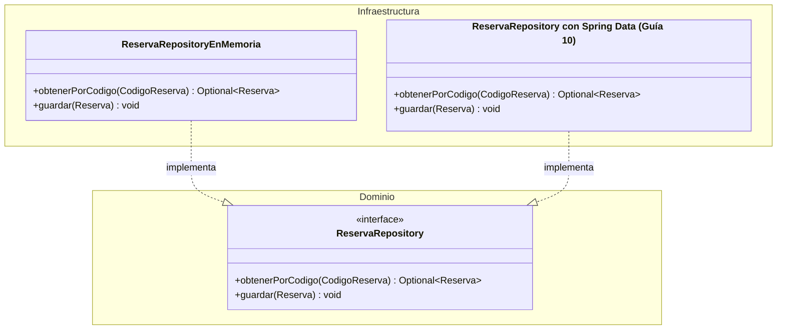

**Programa de Ingeniería de Sistemas y Computación Universidad del Quindío**

**Curso:** Programación Avanzada 
**Guía:** 06 
**Título:** Casos de Uso — La Capa de Aplicación 
**Duración estimada:** 90 minutos 
**Docente:** Jhan Carlos Martinez Ceballos 
**Proyecto del semestre:** SGA — Sistema de Gestión de Alojamiento

---

# 1. Objetivo

En las guías anteriores construimos:

- entidades y objetos de valor del SGA (Guía 04),
- agregados, reglas de negocio y servicios de dominio (Guía 05),
- pruebas unitarias del dominio (Guía 05.1).

Ahora tenemos un **dominio rico** que sabe qué está permitido y qué no, y que además sabemos que funciona correctamente. Pero surge una pregunta:

> "Ya tengo un dominio rico... ¿cómo se usa desde afuera sin dañarlo?"

Esta guía responde esa pregunta.

El objetivo **no es agregar más reglas de negocio**, sino aprender a:

- orquestar el dominio del SGA desde una capa externa,
- coordinar `Reserva`, `Apartamento` y sus repositorios sin tomar decisiones de negocio,
- preparar el sistema para exponerlo por REST (sin hacerlo aún).

> En esta guía el código sigue siendo Java puro: no hay Spring, no hay HTTP, no hay base de datos real todavía.

---

# 2. Conceptos básicos

1. **Caso de uso.** Una intención concreta de un actor sobre el sistema (crear una reserva, confirmarla, cancelarla). No es un servicio de negocio renombrado.
2. **Intención.** Lo que un actor quiere lograr, expresado con parámetros simples o tipos del dominio, nunca con estructuras técnicas (JSON, `HttpRequest`, DTOs de framework).
3. **Orquestación.** Obtener objetos, invocar su comportamiento y guardar el resultado, en ese orden. Orquestar no es decidir: la decisión ya vive en el dominio.
4. **Puerto (repositorio).** Interfaz que el dominio define para pedir o guardar objetos, sin decir cómo se almacenan. En el SGA: `ReservaRepository`, `ApartamentoRepository`.
5. **Adaptador.** Implementación concreta de un puerto (en memoria por ahora; con H2 y Spring Data JPA desde la Guía 10). El caso de uso nunca sabe cuál está usando.
6. **Servicio de dominio.** Objeto sin identidad que aplica una regla que involucra más de un agregado. Ya se usó en la Guía 05 para las reglas que `Reserva` no puede verificar por sí sola.

---

# 3. Contextualización teórica

## 3.1 ¿Qué es un Caso de Uso?

Un **caso de uso** representa una acción que alguien quiere realizar sobre el SGA. No es una definición UML formal: es una intención concreta.

- El huésped **crea una reserva** por el portal.
- La recepcionista **confirma** una reserva.
- La recepcionista **registra la llegada** de un grupo.
- El administrador **consulta** las reservas de un apartamento en un estado dado.

Cada una tiene un **actor** (sección 7.1 del proyecto: Huésped, Recepcionista, Administrador, Personal de servicio) y un **propósito**.

## 3.2 Un Caso de Uso NO es

- Un servicio de negocio renombrado.
- Una clase que valida reglas complejas.
- Un lugar para poner `if` de negocio.
- Un CRUD de `Reserva` con otro nombre.
- Una excusa para introducir Spring.

Si una clase de `application.usecase` decide **si algo está permitido**, no es un caso de uso: es una regla de negocio mal ubicada.

## 3.3 Un Caso de Uso SÍ es

Un **orquestador** que:

1. recibe una intención (parámetros simples o value objects),
2. obtiene o crea objetos del dominio,
3. invoca comportamiento del dominio (o un servicio de dominio, si la regla cruza agregados),
4. devuelve un resultado.

Nada más.

## 3.4 El rol de cada capa

| Capa                          | Responsabilidad                                                                      |
| ----------------------------- | ------------------------------------------------------------------------------------ |
| **Dominio**                   | Reglas, invariantes, comportamiento (`Reserva`, `Apartamento`, servicios de dominio) |
| **Apliacacion - Caso de uso** | Orquestar el dominio                                                                 |
| **Infraestructura**           | Detalles técnicos: REST, H2/JPA (Guías 08 y 10)                                      |

El dominio **sabe qué está permitido**. El caso de uso **sabe cuándo y en qué orden**.

## 3.5 ¿De dónde vienen los objetos del dominio?

Observe el paso 2: _"obtener o crear objetos del dominio"_. Si un caso de uso necesita una `Reserva` para confirmarla, ¿de dónde la obtiene?

En el SGA esas reservas estarán almacenadas en algún lugar — por ahora un `HashMap`, más adelante H2 — pero el caso de uso **no debería saber** dónde ni cómo. Eso es un detalle técnico. Necesitamos un mecanismo que permita pedir objetos del dominio sin conocer su origen: el **Repositorio**.

## 3.6 El patrón Repository (DDD)

En DDD, un repositorio no es una clase de acceso a datos. Es un concepto más abstracto:

> Un repositorio simula una **colección en memoria** de objetos del dominio.

Desde el caso de uso, un repositorio es un lugar donde se puede **buscar** (por identificador o por criterio) y **guardar**. Se expresa como una interfaz:

```java
// Esto es un contrato, no una implementación
public interface ReservaRepository {
    Optional<Reserva> obtenerPorCodigo(CodigoReserva codigo);
    void guardar(Reserva reserva);
}
```

Tres decisiones se mantienen durante todo el semestre:

- **Los nombres son del negocio**: `obtenerPorCodigo`, `guardar`. No `findById` ni `save`.
- **Los parámetros son tipos del dominio**: `CodigoReserva`, no `String`.
- **Solo aparecen las operaciones que el dominio necesita.** El SGA nunca borra una reserva: su ciclo de vida termina en un estado terminal —`FINALIZADA`, `CANCELADA` o `NO_SHOW` (sección 8 del proyecto)— y las eliminaciones de registros son **lógicas, nunca físicas** (12.4). Por eso este puerto no ofrece `borrar`.

> Estas reglas parecen obvias ahora y son fáciles de perder cuando llegue el framework. En la **Guía 10** volveremos sobre ellas para comprobar que el puerto sigue intacto.

## 3.7 Interfaz en el dominio, implementación en infraestructura

Principio de **Inversión de Dependencias**: las capas internas (dominio) definen **qué** necesitan; las externas (infraestructura) definen **cómo** se cumple.



La interfaz vive en el **dominio** porque es el dominio quien necesita esas operaciones. La implementación concreta llega en guías posteriores.

## 3.8 ¿Por qué en memoria por ahora?

Usaremos implementaciones **en memoria** (`HashMap`). Ventajas:

1. **Validar el diseño sin atarse a tecnología**: probamos que los casos de uso funcionan sin instalar ninguna base de datos.
2. **Enfoque en la orquestación**, no en configuración de infraestructura.
3. **Intercambiabilidad**: en la Guía 10 reemplazaremos la implementación en memoria por H2 con Spring Data JPA **sin tocar una línea de los casos de uso**.

---

# 4. Parte 1: Estructura de un caso de uso

## 4.1 Forma mental

```
1. Recibir intención (parámetros simples o value objects)
         ↓
2. Obtener o crear objetos del dominio
         ↓
3. Invocar comportamiento del dominio
         ↓
4. Devolver resultado
```

## 4.2 Ejemplo: Confirmar una Reserva

Este es el caso más simple posible: la regla depende **solo** del propio agregado, así que no necesita ningún servicio de dominio.

```java
package co.edu.uniquindio.sga.application.usecase;

import co.edu.uniquindio.sga.application.exception.ReservaNoEncontradaException;
import co.edu.uniquindio.sga.domain.entity.Reserva;
import co.edu.uniquindio.sga.domain.repository.ReservaRepository;
import co.edu.uniquindio.sga.domain.valueobject.CodigoReserva;

public class ConfirmarReservaUseCase {

    private final ReservaRepository reservaRepository;

    public ConfirmarReservaUseCase(ReservaRepository reservaRepository) {
        this.reservaRepository = reservaRepository;
    }

    public void ejecutar(CodigoReserva codigo) {
        Reserva reserva = reservaRepository.obtenerPorCodigo(codigo)
            .orElseThrow(() -> new ReservaNoEncontradaException(codigo));

        reserva.confirmar();

        reservaRepository.guardar(reserva);
    }
}
```

Observe:

- no hay reglas de negocio aquí,
- no hay `if` sobre el estado de la reserva,
- solo coordinación: obtener, invocar, guardar.

Las dos validaciones que deciden si la reserva **puede** confirmarse viven en el dominio, tal como se dejaron en la Guía 05:

```java
// En el dominio (Guía 05)
public class Reserva {

    public void confirmar() {
        if (this.estado != EstadoReserva.PENDIENTE) {
            throw new ReglaDominioException(
                "Solo una reserva PENDIENTE puede confirmarse");                      // RN-08
        }
        if (this.horaEstimadaLlegada == null) {
            throw new ReglaDominioException(
                "La reserva debe registrar hora estimada de llegada para confirmarse"); // RN-09
        }
        this.estado = EstadoReserva.CONFIRMADA;
    }
}
```

El caso de uso **no repite** esa lógica. Solo coordina.

> **Por qué RN-09 se verifica aquí y no en `crear(...)`.** La regla dice _"antes de confirmarse"_, no _"al crearse"_: una reserva que entra por un canal externo (7.8) puede existir como `PENDIENTE` sin hora estimada de llegada. Si su equipo la exigió ya en `crear(...)`, RN-09 se vuelve imposible de violar y queda sin caso de falla que probar, cuando el proyecto exige prueba unitaria **también del caso en que la regla se viola** (12.4). Revise dónde la ubicó antes de continuar.

## 4.3 Lo que un caso de uso NO hace

Un caso de uso:

- no valida estados complejos,
- no decide si algo está permitido,
- no contiene `if` de negocio,
- no conoce HTTP, JSON ni bases de datos,
- no sabe de roles ni autenticación (eso llega en la Guía 12).

Esas responsabilidades pertenecen a otras capas.

---

# 5. Parte 2: Orquestando entre agregados

`ConfirmarReservaUseCase` fue el caso fácil: una sola regla, un solo agregado. Pero en la Guía 05 se tomó una decisión de diseño que tiene consecuencias directas aquí:

> `Reserva` referencia a `Apartamento` por su identificador (`IdentificacionApartamento`), **no por el objeto completo**.

Eso protege la frontera del agregado (`Reserva` no puede navegar silenciosamente hacia otro agregado), pero significa que `Reserva` **ya no puede** verificar por sí misma reglas que dependen de los datos del apartamento —su capacidad, su estado operativo—. Esas reglas **salieron del agregado hacia un servicio de dominio**.

Conviene tener el cambio a la vista, porque el código de esta guía se apoya en él:

```java
// Guía 04: la reserva recibía el objeto y podía preguntarle por su capacidad
public static Reserva crear(CodigoReserva codigo, Apartamento apartamento, Estancia estancia,
                            Ocupante titular, List<Ocupante> ocupantes,
                            CanalOrigen canalOrigen, LocalDate fechaActual) { ... }

// Guía 05: la reserva solo guarda el identificador del apartamento
public static Reserva crear(CodigoReserva codigo, IdentificacionApartamento apartamentoId,
                            Estancia estancia, Ocupante titular, List<Ocupante> ocupantes,
                            CanalOrigen canalOrigen, LocalDate fechaActual) { ... }
```

Con ese cambio, las comprobaciones que en la Guía 04 vivían **dentro** de `crear(...)` —apartamento activo y capacidad suficiente (RN-02)— dejaron de caber ahí: la reserva ya no tiene a quién preguntarle. El acceso también cambió de nombre: `getApartamento()` pasó a ser `getApartamentoId()`.

> Si su equipo conservó el objeto `Apartamento` completo dentro de `Reserva`, el resto de la guía sigue siendo aplicable, pero tendrá que sustentar cómo evita que un agregado modifique al otro. La decisión se toma en la Guía 05, no aquí.

## 5.1 La interfaz de los repositorios necesarios

```java
package co.edu.uniquindio.sga.domain.repository;

import java.util.List;
import java.util.Optional;

import co.edu.uniquindio.sga.domain.entity.Reserva;
import co.edu.uniquindio.sga.domain.valueobject.CodigoReserva;
import co.edu.uniquindio.sga.domain.valueobject.EstadoReserva;
import co.edu.uniquindio.sga.domain.valueobject.IdentificacionApartamento;

/**
 * Puerto del dominio: describe QUÉ necesita el dominio, no CÓMO se implementa.
 *
 * Convención de nombres:
 *  - obtenerPorX : recupera un elemento por su identidad (devuelve Optional)
 *  - buscarPorX  : recupera una colección según un criterio
 */
public interface ReservaRepository {

    Optional<Reserva> obtenerPorCodigo(CodigoReserva codigo);

    void guardar(Reserva reserva);

    List<Reserva> buscarPorEstado(EstadoReserva estado);

    /** Reservas PENDIENTE, CONFIRMADA o EN_CURSO del apartamento: las que "cuentan" para RN-01 y RN-20. */
    List<Reserva> buscarActivasPorApartamento(IdentificacionApartamento apartamentoId);
}
```

```java
package co.edu.uniquindio.sga.domain.repository;

import java.util.Optional;

import co.edu.uniquindio.sga.domain.entity.Apartamento;
import co.edu.uniquindio.sga.domain.valueobject.IdentificacionApartamento;

public interface ApartamentoRepository {
    Optional<Apartamento> obtenerPorIdentificacion(IdentificacionApartamento identificacion);
    void guardar(Apartamento apartamento);
}
```

> Ninguna de las dos interfaces borra nada. Ni `Reserva` ni `Apartamento` desaparecen del sistema: cambian de estado (F-06, 3.3).

## 5.2 Cuando la regla depende de otro agregado

En la Guía 05, las reglas **RN-01** (solapamiento), **RN-02** (capacidad) y **RN-20** (tiempo de preparación) quedaron fuera de `Reserva.crear(...)`, precisamente porque necesitan datos que `Reserva` ya no guarda como objeto. Se resolvieron con un servicio de dominio, que es también el lugar de **RN-07** (bloqueos) para los equipos que ya modelaron `Bloqueo`:

```java
package co.edu.uniquindio.sga.domain.service;

import java.util.List;

// Definido en la Guía 05: verifica RN-01, RN-02, RN-07 y RN-20 antes de crear o
// modificar una reserva. Aquí solo se CONSUME; el cuerpo no se repite.
public class DisponibilidadReservaService {

    // El tiempo de preparación (L-13) y las horas de entrada y salida (L-12) son
    // configuración del alojamiento: llegan por constructor, nunca como constantes.

    public void verificarDisponibilidad(Apartamento apartamento, Estancia estancia,
                                        int cantidadOcupantes,
                                        List<Reserva> reservasActivasDelApartamento) {
        // Lanza ReglaDominioException si el apartamento no está activo,
        // no admite la cantidad de ocupantes (RN-02), se solapa con alguna de las
        // reservas recibidas (RN-01) o no respeta el tiempo de preparación (RN-20).
    }
}
```

> **¿De dónde salen esas reservas?** El servicio no las busca: **se las entregan**. Así sigue siendo dominio puro y quien consulta el repositorio es el caso de uso, que es su oficio. Si en su Guía 05 el servicio recibió el `ReservaRepository` por constructor, también es válido —el puerto vive en el dominio—. Lo que no es válido es que el **caso de uso** compare fechas para decidir si hay solapamiento.

> **Bloqueos (RN-07).** La condición 5 de 7.5 incluye los bloqueos, no solo las reservas. Si su equipo ya modeló `Bloqueo`, es este servicio el que debe verificarlos, con la misma forma: los recibe, no los busca.

Esto es exactamente el mismo principio que ya conoce de la Guía 05: una regla que depende del estado de **otro** agregado no la evalúa el caso de uso, y tampoco el agregado que la origina. La evalúa un servicio de dominio.

**Las seis condiciones de 7.5, una por una.** El proyecto fija seis validaciones para crear una reserva. Ninguna vive en el caso de uso:

|# (7.5)|Condición|Regla|Dónde vive|
|---|---|---|---|
|1|Fecha de salida posterior a la de entrada|RN-03|`Estancia`, al construirse (Guía 04)|
|2|Fecha de entrada no anterior a hoy|RN-04|`Reserva.crear(...)` (Guía 04)|
|3|Apartamento activo y con tarifas completas|—|`DisponibilidadReservaService`|
|4|Capacidad suficiente para el total de ocupantes|RN-02|`DisponibilidadReservaService`|
|5|Sin solapamiento con reservas activas ni bloqueos|RN-01, RN-07|`DisponibilidadReservaService`|
|6|Tiempo de preparación respetado|RN-20|`DisponibilidadReservaService`|
|—|Que todas se ejecuten, y en qué orden|—|`CrearReservaUseCase`|

> El **orden** de 7.5 tampoco es decorativo: quien reserva debe enterarse de que sus fechas son inválidas antes que de que el apartamento está ocupado. Como las condiciones 1 y 2 se verifican al construir la `Estancia` y dentro de `Reserva.crear(...)`, respetar el orden exacto es una decisión de diseño de su equipo, que se resuelve en el dominio y se sustenta. No se resuelve con `if` dentro del caso de uso.

## 5.3 Ejemplo: Crear una Reserva

Este caso de uso sí necesita coordinar dos agregados (`Apartamento` y `Reserva`) y un servicio de dominio:

```java
package co.edu.uniquindio.sga.application.usecase;

import java.time.LocalDate;
import java.util.List;

import co.edu.uniquindio.sga.application.exception.ApartamentoNoEncontradoException;
import co.edu.uniquindio.sga.domain.entity.Apartamento;
import co.edu.uniquindio.sga.domain.entity.Ocupante;
import co.edu.uniquindio.sga.domain.entity.Reserva;
import co.edu.uniquindio.sga.domain.repository.ApartamentoRepository;
import co.edu.uniquindio.sga.domain.repository.GeneradorCodigoReserva;
import co.edu.uniquindio.sga.domain.repository.ReservaRepository;
import co.edu.uniquindio.sga.domain.service.DisponibilidadReservaService;
import co.edu.uniquindio.sga.domain.valueobject.CanalOrigen;
import co.edu.uniquindio.sga.domain.valueobject.CodigoReserva;
import co.edu.uniquindio.sga.domain.valueobject.Estancia;
import co.edu.uniquindio.sga.domain.valueobject.IdentificacionApartamento;

public class CrearReservaUseCase {

    private final ReservaRepository reservaRepository;
    private final ApartamentoRepository apartamentoRepository;
    private final GeneradorCodigoReserva generadorCodigo;
    private final DisponibilidadReservaService disponibilidadService;

    public CrearReservaUseCase(ReservaRepository reservaRepository,
                               ApartamentoRepository apartamentoRepository,
                               GeneradorCodigoReserva generadorCodigo,
                               DisponibilidadReservaService disponibilidadService) {
        this.reservaRepository = reservaRepository;
        this.apartamentoRepository = apartamentoRepository;
        this.generadorCodigo = generadorCodigo;
        this.disponibilidadService = disponibilidadService;
    }

    public Reserva ejecutar(IdentificacionApartamento apartamentoId, Estancia estancia,
                            Ocupante titular, List<Ocupante> ocupantes,
                            CanalOrigen canalOrigen, LocalDate fechaActual) {

        Apartamento apartamento = apartamentoRepository.obtenerPorIdentificacion(apartamentoId)
            .orElseThrow(() -> new ApartamentoNoEncontradoException(apartamentoId));

        // El caso de uso BUSCA los datos; no los interpreta.
        List<Reserva> reservasActivas =
            reservaRepository.buscarActivasPorApartamento(apartamentoId);

        // RN-01, RN-02, RN-20: Reserva ya no puede verificarlas por sí sola,
        // porque solo conoce el IDENTIFICADOR del apartamento, no el objeto.
        disponibilidadService.verificarDisponibilidad(apartamento, estancia,
                                                      ocupantes.size(), reservasActivas);

        CodigoReserva codigo = generadorCodigo.generar();

        Reserva reserva = Reserva.crear(codigo, apartamentoId, estancia, titular,
                                        ocupantes, canalOrigen, fechaActual);

        reservaRepository.guardar(reserva);

        return reserva;
    }
}
```

Observe la diferencia con `ConfirmarReservaUseCase`:

- aquí sí hay un paso adicional (el servicio de dominio) **antes** de invocar el comportamiento del agregado,
- el caso de uso consulta el repositorio para **alimentar** al servicio: buscar no es decidir,
- pero el caso de uso sigue sin decidir nada: solo pregunta, y actúa según la respuesta,
- `Reserva.crear(...)` recibe `apartamentoId` (el identificador), no `apartamento` (el objeto) — coherente con la Guía 05.

`GeneradorCodigoReserva` es un puerto más, del mismo tipo que un repositorio aunque no calce en el molde "obtener/guardar" (si su equipo separó un paquete `domain.port`, ese es su lugar natural):

```java
package co.edu.uniquindio.sga.domain.repository;

import co.edu.uniquindio.sga.domain.valueobject.CodigoReserva;

public interface GeneradorCodigoReserva {
    CodigoReserva generar();
}
```

## 5.4 Una nota sobre el Folio

La sección 7.7 del proyecto es clara: **"el folio se abre al crear la reserva"** (F-08). Eso significa que `CrearReservaUseCase`, en su versión completa, también coordina un `FolioRepository` para abrir el folio con el cargo de alojamiento ya calculado (RN-05). En ese mismo acto la reserva **congela** su valor y la versión de la política de cancelación vigente (RN-22, 3.5): todo lo que se cobre o se retenga después se calcula con esos valores, no con los del día en que ocurra el hecho.

No se muestra ese paso aquí a propósito: calcular el valor de la estancia (tarifa por noche × ocupante facturable, según la temporada de cada noche) es lógica de dominio que ya debió resolverse en la Guía 05 sobre `Tarifa` y `Temporada`, y repetirla en esta guía la convertiría en un ejercicio de dominio, no de orquestación. **Es parte de su actividad** extender `CrearReservaUseCase` para que también abra el folio, reutilizando lo que ya construyó.

## 5.5 Implementación en memoria del repositorio

```java
package co.edu.uniquindio.sga.infrastructure.persistence.inmemory;

// Adaptador temporal: se reemplaza en la Guía 10 por una implementación con
// Spring Data JPA sobre H2, sin modificar ReservaRepository ni los casos de uso.
public class ReservaRepositoryEnMemoria implements ReservaRepository {

    private final Map<CodigoReserva, Reserva> reservas = new HashMap<>();

    @Override
    public Optional<Reserva> obtenerPorCodigo(CodigoReserva codigo) {
        return Optional.ofNullable(reservas.get(codigo));
    }

    @Override
    public void guardar(Reserva reserva) {
        reservas.put(reserva.getCodigo(), reserva);
    }

    @Override
    public List<Reserva> buscarPorEstado(EstadoReserva estado) {
        return reservas.values().stream()
            .filter(r -> r.getEstado() == estado)
            .toList();
    }

    @Override
    public List<Reserva> buscarActivasPorApartamento(IdentificacionApartamento apartamentoId) {
        return reservas.values().stream()
            .filter(r -> r.getApartamentoId().equals(apartamentoId))
            .filter(r -> r.getEstado().esActiva())   // PENDIENTE, CONFIRMADA o EN_CURSO
            .toList();
    }
}
```

> **¿Por qué `Optional` y no lanzar la excepción aquí?** Porque "no existe" no es un error para el repositorio: es una respuesta legítima. Quien decide si eso constituye un fallo es el caso de uso, que conoce la intención. El repositorio informa; la capa de aplicación interpreta.

---

# 6. Parte 3: Estructura del proyecto y catálogo de casos de uso

## 6.1 Paquetes

Los casos de uso viven separados del dominio:

```
src/main/java/co/edu/uniquindio/sga/
├── domain/
│   ├── entity/
│   │   ├── Reserva.java
│   │   ├── Apartamento.java
│   │   └── Ocupante.java
│   ├── valueobject/
│   │   ├── CodigoReserva.java
│   │   ├── IdentificacionApartamento.java
│   │   ├── EstadoReserva.java
│   │   └── ...
│   ├── repository/
│   │   ├── ReservaRepository.java
│   │   ├── ApartamentoRepository.java
│   │   ├── FolioRepository.java                (actividad: sección 5.4)
│   │   └── GeneradorCodigoReserva.java
│   ├── service/
│   │   └── DisponibilidadReservaService.java   (Guía 05)
│   └── exception/
│       └── ReglaDominioException.java
│
├── application/
│   ├── usecase/
│   │   ├── CrearReservaUseCase.java
│   │   ├── ConfirmarReservaUseCase.java
│   │   └── ...  (los que faltan: sección 6.2)
│   └── exception/
│       ├── ReservaNoEncontradaException.java
│       └── ApartamentoNoEncontradoException.java
│
└── infrastructure/
    └── persistence/
        └── inmemory/
            ├── ReservaRepositoryEnMemoria.java
            └── ApartamentoRepositoryEnMemoria.java
```

Observe: `domain/` contiene las reglas; `application/usecase/` contiene la coordinación; `infrastructure/` contiene los adaptadores. Ni `domain/` ni `application/` dependen de Spring, REST ni bases de datos.

> **¿Por qué `ReservaNoEncontradaException` no está en `domain.exception`?** Porque "no existe" no es una regla del negocio violada, sino una coordinación que falló: el identificador recibido no corresponde a nada. Por eso acompaña al caso de uso, no al dominio. La distinción se vuelve visible en la **Guía 08**, donde esta excepción se traducirá a `404 Not Found` y `ReglaDominioException` no.

## 6.2 Catálogo de casos de uso pendientes

Los dos casos de uso de las secciones 4 y 5 son la base del patrón. El resto del ciclo de vida (sección 8 del proyecto) sigue el **mismo patrón**, pero cada uno tiene su propia combinación de reglas. No se muestran resueltos: constrúyalos usted mismo en la actividad, usando la tabla como mapa.

|Caso de uso|Intención|Reglas clave|Punto de diseño a resolver|
|---|---|---|---|
|`CancelarReservaUseCase`|Cancela una reserva `PENDIENTE` o `CONFIRMADA`, antes del registro|RN-08, RN-12, RN-13|La retención se calcula con la **política congelada en la reserva**, no con la vigente hoy (Guía 05). El resultado se registra en el folio, no en un objeto aparte.|
|`RegistrarLlegadaUseCase`|Registra el check-in del grupo|RN-08, RN-10, RN-11|RN-10 depende solo del estado de la propia `Reserva` (puede vivir en `Reserva.registrarLlegada()`). RN-11 depende de `Apartamento` (`puedeRecibirGrupo()`, ya existe desde la Guía 04). Dos agregados cambian en la misma operación: decida quién coordina esa doble transición.|
|`RegistrarSalidaUseCase`|Registra el check-out del grupo|RN-08, RN-12, RN-17|La reserva pasa a `FINALIZADA`; el apartamento pasa a `PENDIENTE_PREPARACION`. El cierre del folio es requisito, **salvo autorización del administrador** (7.6, RN-17): modélelo sin que el caso de uso decida si autorizar o no.|
|`DeclararNoShowUseCase`|Marca que el titular no se presentó|RN-08, RN-13|Solo transita desde `CONFIRMADA` (sección 8), y solo a partir de la hora límite configurada (L-15), que es configuración, no constante. Comparte la lógica de "política congelada" con la cancelación, pero es un disparador distinto: no lo fusione con `CancelarReservaUseCase` (sección 3.3 de esta guía).|
|`VencerReservasPendientesUseCase`|Cancela automáticamente las reservas `PENDIENTE` que superaron el plazo de confirmación|RN-21|No lo dispara un actor humano, sino el paso del tiempo. El plazo de confirmación (L-14) es configuración y llega como parámetro, igual que `fechaActual`. Constrúyalo como un caso de uso normal e invóquelo manualmente por ahora; el proyecto exige que el vencimiento ocurra **sin intervención manual** (7.5), así que programar su ejecución será tarea del equipo cuando el caso de uso sea un componente de Spring (Guía 09).|
|`ConsultarReservasPorEstadoUseCase`|Lista las reservas en un estado dado|—|El más simple del catálogo: siga exactamente el patrón de `buscarPorEstado` que ya está en `ReservaRepository`. Una sola línea en el cuerpo del `ejecutar`. La paginación de 10 por página que exige el proyecto (7.5) llega con la Guía 11: no la improvise aquí.|

**Desafío opcional:** `ModificarReservaUseCase` (cambiar fechas, ocupantes o apartamento asignado). La sección 7.5 exige revalidar las seis condiciones de creación y registrar la diferencia de valor como **ajuste** en el folio (RN-14). Es, en la práctica, `CrearReservaUseCase` y `DisponibilidadReservaService` reutilizados sobre una reserva existente en lugar de una nueva.

## 6.3 Aplicación al proyecto final

Si su equipo definió una regla propia (L-XX, Anexo A) que afecta el ciclo de vida de la reserva —por ejemplo, una aprobación adicional antes de confirmar, o un requisito extra para el check-in—, este es el lugar para materializarla: como un paso más dentro del caso de uso correspondiente, o como un servicio de dominio nuevo si la regla cruza agregados. No la agregue directamente en un controlador que todavía no existe (Guía 08).

---

# 7. Parte 4: Actividad

## Objetivo

Implementar los casos de uso que orquestan el dominio del SGA ya construido en las guías anteriores.

## Instrucciones

1. **Cree los repositorios** `ReservaRepository`, `ApartamentoRepository` y `GeneradorCodigoReserva` en el paquete `domain.repository`, con exactamente las operaciones que el dominio necesita (ni una más).
    
2. **Cree las excepciones** `ReservaNoEncontradaException` y `ApartamentoNoEncontradoException` (o las que su modelo necesite) en el paquete `application.exception`, para los casos en que un identificador no exista.
    
3. **Implemente los dos casos de uso de esta guía** (`ConfirmarReservaUseCase`, `CrearReservaUseCase`) tal como se mostraron, adaptando los nombres a los que ya tiene en su propio dominio.
    
4. **Extienda `CrearReservaUseCase`** para que también abra el folio (sección 5.4), coordinando `FolioRepository`.
    
5. **Construya, sin ejemplo previo,** los seis casos de uso de la tabla 6.2: `CancelarReservaUseCase`, `RegistrarLlegadaUseCase`, `RegistrarSalidaUseCase`, `DeclararNoShowUseCase`, `VencerReservasPendientesUseCase` y `ConsultarReservasPorEstadoUseCase`.
    
6. **Cree una implementación en memoria** de cada repositorio, en `infrastructure.persistence.inmemory`, para poder probar los casos de uso sin base de datos.
    
7. **Importante:** el dominio **no se modifica** en esta guía, salvo que le falte un método de comportamiento que ya debió existir desde la Guía 05. Si nota que le falta, agréguelo allí —en la entidad o el servicio de dominio—, nunca en el caso de uso.
    
8. **Pruebe manualmente:** una clase `Main` temporal que ejecute cada caso de uso con los repositorios en memoria es suficiente por ahora; las pruebas automatizadas de la capa de aplicación llegan más adelante.
    

---

# 8. Precauciones y recomendaciones

1. **No dupliques validaciones.** Si el dominio o un servicio de dominio ya valida algo, no lo repitas en el caso de uso.
2. **Parámetros simples.** Los casos de uso reciben tipos simples o value objects, no DTOs (eso viene en la Guía 07).
3. **Un caso de uso = una intención.** No mezcle `CancelarReservaUseCase` y `DeclararNoShowUseCase`: son transiciones distintas, con disparadores distintos.
4. **Dos agregados, una operación:** cuando una intención cambia más de un agregado (`RegistrarLlegadaUseCase`), decida explícitamente quién coordina esa transición y por qué; no lo resuelva "sobre la marcha".
5. **El repositorio no borra nada.** Ninguna interfaz de esta guía debería tener un método `borrar`. Si lo tiene, revise qué regla del proyecto lo justifica.
6. **Sin frameworks todavía.** Ni `application/` ni `domain/` dependen de Spring en esta guía. Estos mismos casos de uso se convierten en componentes de Spring en la **Guía 09**, sin cambiar su contenido.
7. **La configuración no se quema.** Plazo de confirmación, hora límite de no-show, tiempo de preparación y umbral de edad son valores de la Ficha del Alojamiento (sección 6 del proyecto). Llegan por parámetro o por constructor, nunca como constantes dentro del caso de uso.

---

# 9. Verificación

Antes de cerrar la guía, confirme:

|#|Criterio|
|---|---|
|1|Existen `ReservaRepository`, `ApartamentoRepository` y `GeneradorCodigoReserva` en `domain.repository`, con solo las operaciones necesarias|
|2|`ConfirmarReservaUseCase` y `CrearReservaUseCase` están implementados y compilan|
|3|`CrearReservaUseCase` invoca el servicio de dominio antes de invocar `Reserva.crear(...)`, y `Reserva.crear(...)` recibe el identificador del apartamento, no el objeto|
|4|`CrearReservaUseCase` abre el folio de la reserva (5.4), coordinando `FolioRepository`|
|5|Los seis casos de uso de la tabla 6.2 están implementados|
|6|Cada caso de uso vive en `application.usecase` y depende de interfaces, no de implementaciones concretas|
|7|Las excepciones de "no encontrado" viven en `application.exception`, separadas de `ReglaDominioException`|
|8|Existe una implementación en memoria de cada repositorio, en `infrastructure.persistence.inmemory`, usada para probar manualmente|
|9|Ninguna clase de `application` ni `domain` importa `org.springframework`|
|10|Ningún caso de uso contiene un `if` que decida sobre una regla de negocio (capacidad, solapamiento, estado permitido)|
|11|Ningún valor de la Ficha del Alojamiento (plazos, horas, umbrales) está quemado en un caso de uso|
|12|`./gradlew build` termina sin errores|
|13|El trabajo está versionado, con commits de todos los integrantes|

---

# 10. Evaluación o resultado

Al finalizar esta guía, el estudiante debe:

1. Distinguir con claridad qué vive en el dominio y qué vive en la capa de aplicación.
2. Saber justificar, para cada caso de uso, por qué una regla determinada vive en el agregado, en un servicio de dominio o en ninguno de los dos lugares (porque el caso de uso solo consulta).
3. Haber implementado el catálogo completo de casos de uso del ciclo de vida de la reserva.
4. Poder probar manualmente el sistema completo sin ninguna base de datos real.
5. Explicar por qué `Reserva` ya no puede validar su propia capacidad ni el estado del apartamento, y dónde quedó esa responsabilidad.

**Entregable:** enlace al repositorio con el paquete `application.usecase` implementado, más los repositorios en memoria usados para probarlo.

---

# 11. Próxima actividad

En la **Guía 07: Diseño de APIs desde el Dominio** aprenderemos a:

- mapear los casos de uso construidos hoy a endpoints REST,
- diseñar DTOs de entrada y salida (sin filtrar tipos del dominio hacia afuera),
- documentar la API con OpenAPI.

> Los casos de uso que construyó hoy serán exactamente los que expondrá mañana. Si un caso de uso es difícil de exponer como endpoint, la guía siguiente rara vez es el problema: revise primero si la intención estaba bien definida aquí.

**Completar**

1. Los criterios de verificación de la sección 9.
2. Los seis casos de uso del catálogo (6.2) y la extensión de `CrearReservaUseCase` con el folio (5.4).

**Leer**

1. Vernon, V. (2013). _Implementing Domain-Driven Design_, capítulo 14: "Application" (servicios de aplicación).
2. Cockburn, A. (2000). _Writing Effective Use Cases_, capítulos 1 y 2: actor, alcance e intención.

**Investigar**

1. **Servicio de aplicación** frente a **servicio de dominio**: qué decide cada uno.
2. **Inversión de dependencias**: por qué la interfaz del repositorio vive en el dominio y no en infraestructura.
3. **Idempotencia**: qué debería pasar si el mismo caso de uso se ejecuta dos veces con los mismos datos (RN-19 lo exigirá para el canal externo).

> Pregunta para pensar antes de la próxima clase: si `RegistrarLlegadaUseCase` cambia dos agregados (`Reserva` y `Apartamento`) y el segundo falla, ¿qué debería quedar guardado? La respuesta completa llega con `@Transactional` en la Guía 09, pero la decisión de diseño es de hoy.

---

# 12. Referencias bibliográficas

1. Evans, E. (2003). _Domain-Driven Design: Tackling Complexity in the Heart of Software_. Addison-Wesley.
2. Vernon, V. (2013). _Implementing Domain-Driven Design_. Addison-Wesley.
3. Martin, R. C. (2017). _Clean Architecture: A Craftsman's Guide to Software Structure and Design_. Prentice Hall.
4. Cockburn, A. (2000). _Writing Effective Use Cases_. Addison-Wesley.
5. Martinez Ceballos, J. C. (2026). _Proyecto Final — SGA: Sistema de Gestión de Alojamiento_, versión 2.0. Universidad del Quindío.

---

> **Recuerda:** un caso de uso que decide es una regla de negocio disfrazada; un caso de uso que solo coordina es el que esta guía pide.